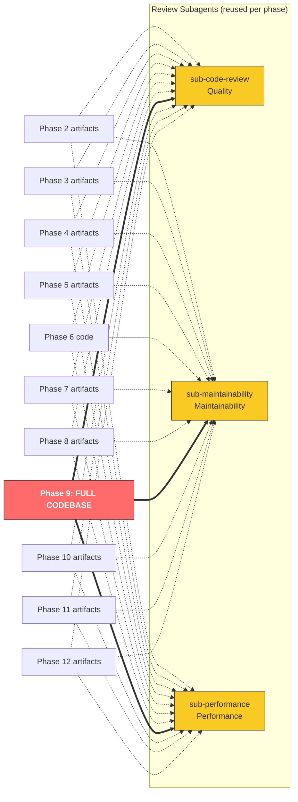
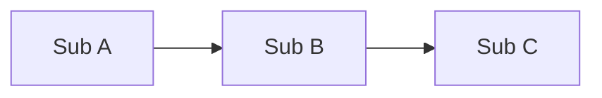
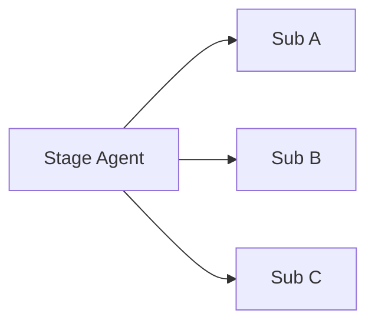
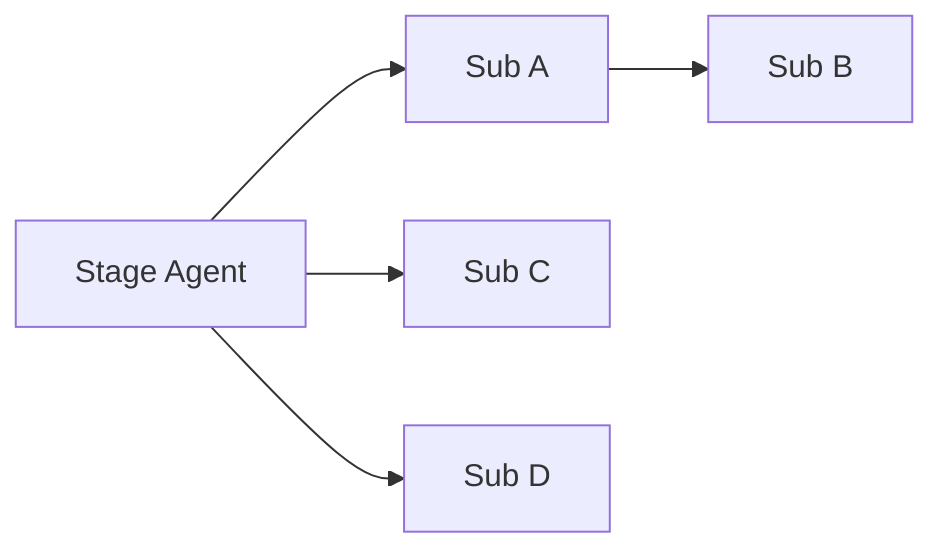
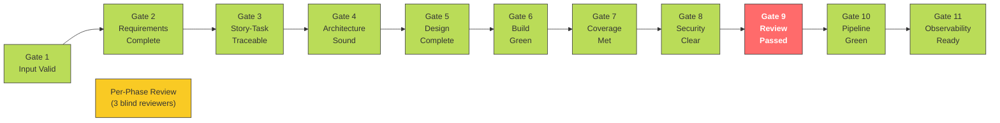

# Agent Relationship Graph

Complete visualization of all 52 agents, their dispatch relationships, data flow, and per-phase review wiring.

---

## Full Agent Hierarchy

```mermaid
graph TD
    ORCH["orch-sdlc<br/>Orchestrator"]

    subgraph "Phase 0: Problem Discovery"
        S0["stage-problem-discovery"]
        S0A["sub-problem-statement-extractor"]
        S0B["sub-user-research-synthesizer"]
        S0C["sub-opportunity-analyzer"]
        S0D["sub-solution-space-explorer"]
        S0 --> S0A & S0B & S0C & S0D
    end

    subgraph "Phase 2: Product"
        S1["stage-product"]
        S1A["sub-requirement-parser"]
        S1B["sub-acceptance-criteria"]
        S1C["sub-risk-analyzer"]
        S1D["sub-assumption-extractor"]
        S1 --> S1A & S1B & S1C & S1D
    end

    subgraph "Phase 3: Story-Tasks"
        S2["stage-story-tasks"]
        S2A["sub-story-writer"]
        S2B["sub-task-decomposer"]
        S2C["sub-dependency-mapper"]
        S2 --> S2A --> S2B --> S2C
    end

    subgraph "Phase 4: Architecture"
        S3["stage-architecture"]
        S3A["sub-tech-stack-advisor"]
        S3B["sub-solution-evaluator"]
        S3C["sub-adr-writer"]
        S3 --> S3A & S3B
        S3A & S3B --> S3C
    end

    subgraph "Phase 5: Design"
        S4["stage-design"]
        S4A["sub-interface-designer"]
        S4B["sub-data-model-designer"]
        S4C["sub-integration-planner"]
        S4D["sub-nfr-evaluator"]
        S4 --> S4A --> S4B
        S4 --> S4C & S4D
    end

    subgraph "Phase 6: Development"
        S5["stage-development"]
        S5A["sub-repo-analyzer"]
        S5B["sub-code-generator"]
        S5C["sub-refactoring-agent"]
        S5D["sub-documentation-agent"]
        S5 --> S5A --> S5B --> S5C --> S5D
    end

    subgraph "Phase 7: Testing"
        S6["stage-testing"]
        S6A["sub-test-data"]
        S6B["sub-unit-test"]
        S6C["sub-integration-test"]
        S6D["sub-regression-test"]
        S6 --> S6A --> S6B & S6C
        S6B & S6C --> S6D
    end

    subgraph "Phase 8: Security"
        S7["stage-security"]
        S7A["sub-secret-scanner"]
        S7B["sub-dependency-scanner"]
        S7C["sub-owasp-reviewer"]
        S7D["sub-policy-validator"]
        S7 --> S7A & S7B & S7C & S7D
    end

    subgraph "Phase 9: Review"
        S8["stage-review"]
        S8A["sub-code-review"]
        S8B["sub-maintainability"]
        S8C["sub-performance"]
        S8 --> S8A & S8B & S8C
    end

    subgraph "Phase 10: DevOps"
        S9["stage-devops"]
    end

    subgraph "Phase 11: Observability"
        S10["stage-observability"]
    end

    subgraph "Phase 12: Retirement (triggered)"
        S12["stage-retirement"]
        S12A["sub-deprecation-planner"]
        S12B["sub-migration-strategist"]
        S12C["sub-data-retention-auditor"]
        S12D["sub-decommission-executor"]
        S12 --> S12A & S12B & S12C & S12D
    end

    ORCH --> S0 --> S1 --> S2 --> S3 --> S4 --> S5 --> S6 --> S7 --> S8 --> S9 --> S10 -.-> S12

    style ORCH fill:#ff6b6b,stroke:#333,color:#fff,font-weight:bold
    style S0 fill:#4ecdc4,stroke:#333,color:#fff
    style S1 fill:#4ecdc4,stroke:#333,color:#fff
    style S2 fill:#4ecdc4,stroke:#333,color:#fff
    style S3 fill:#4ecdc4,stroke:#333,color:#fff
    style S4 fill:#4ecdc4,stroke:#333,color:#fff
    style S5 fill:#4ecdc4,stroke:#333,color:#fff
    style S6 fill:#4ecdc4,stroke:#333,color:#fff
    style S7 fill:#4ecdc4,stroke:#333,color:#fff
    style S8 fill:#4ecdc4,stroke:#333,color:#fff
    style S9 fill:#4ecdc4,stroke:#333,color:#fff
    style S10 fill:#4ecdc4,stroke:#333,color:#fff
    style S12 fill:#4ecdc4,stroke:#333,color:#fff
```



Note: Phase 1 (Bootstrap) is handled directly by the orchestrator and has no dedicated stage agent. Phase 12 (Retirement) runs only when triggered.

---

## Per-Phase Review Wiring

After each phase (except Phase 1 Bootstrap and Phase 9 Review), the orchestrator dispatches the **same 3 review subagents** in blind-parallel mode, scoped to that phase's artifacts. Phase 9 is the full-codebase review.



---

## Agent Count Summary

| Tier | Count | Agents |
|------|-------|--------|
| Orchestrator | 1 | `orch-sdlc` |
| Stage Agents | 12 | `stage-problem-discovery`, `stage-product`, `stage-story-tasks`, `stage-architecture`, `stage-design`, `stage-development`, `stage-testing`, `stage-security`, `stage-review`, `stage-devops`, `stage-observability`, `stage-retirement` |
| Subagents | 39 | See breakdown below |
| **Total** | **52** | |

### Subagent Breakdown

| Stage | # | Subagents |
|-------|---|-----------|
| Problem Discovery | 4 | `sub-problem-statement-extractor`, `sub-user-research-synthesizer`, `sub-opportunity-analyzer`, `sub-solution-space-explorer` |
| Product | 4 | `sub-requirement-parser`, `sub-acceptance-criteria`, `sub-risk-analyzer`, `sub-assumption-extractor` |
| Story-Tasks | 3 | `sub-story-writer`, `sub-task-decomposer`, `sub-dependency-mapper` |
| Architecture | 3 | `sub-tech-stack-advisor`, `sub-solution-evaluator`, `sub-adr-writer` |
| Design | 4 | `sub-interface-designer`, `sub-data-model-designer`, `sub-integration-planner`, `sub-nfr-evaluator` |
| Development | 4 | `sub-repo-analyzer`, `sub-code-generator`, `sub-refactoring-agent`, `sub-documentation-agent` |
| Testing | 4 | `sub-test-data`, `sub-unit-test`, `sub-integration-test`, `sub-regression-test` |
| Security | 4 | `sub-secret-scanner`, `sub-dependency-scanner`, `sub-owasp-reviewer`, `sub-policy-validator` |
| Review | 3 | `sub-code-review`, `sub-maintainability`, `sub-performance` |
| DevOps | 0 | (handled directly by stage agent) |
| Observability | 0 | (handled directly by stage agent) |
| Retirement | 4 | `sub-deprecation-planner`, `sub-migration-strategist`, `sub-data-retention-auditor`, `sub-decommission-executor` |
| Cross-cutting | 2 | `sub-compliance-validator`, `sub-context-optimizer` |

---

## Dispatch Patterns

### Sequential Dispatch
Subagents run in order — each depends on the previous output.



**Used by:** Story-Tasks (writer → decomposer → mapper), Development (analyzer → generator → refactorer → documenter)

### Parallel Dispatch
Subagents run simultaneously with no shared context.



**Used by:** Security (all 4 scanners), Review (3 blind reviewers)

### Mixed Dispatch
Some subagents run first, others depend on their output.



**Used by:** Design (interface designer → data model designer; integration planner and NFR evaluator run independently), Architecture (tech stack + solution evaluator → ADR writer), Testing (test data → unit + integration in parallel → regression)

---

## Data Flow Between Phases

```mermaid
flowchart TD
    SPEC["Input Spec<br/>(PRD / brief / JIRA)"]
    SPEC --> P0

    P0["Phase 0: Problem Discovery<br/>problem-statement.md<br/>business-case.md<br/>go-no-go-decision.md"]
    P0 --> P1

    P1["Phase 1: Bootstrap<br/>normalized-spec.md"]
    P1 --> P2

    P2["Phase 2: Product<br/>requirements.md<br/>acceptance-criteria.md<br/>risks.md<br/>assumptions.md"]
    P2 --> P3

    P3["Phase 3: Story-Tasks<br/>epics.md<br/>stories.md<br/>tasks.json<br/>dependency-graph.md"]
    P3 --> P4

    P4["Phase 4: Architecture<br/>system-design.md<br/>tech-stack.md<br/>solution-evaluation.md<br/>adrs/"]
    P4 --> P5

    P5["Phase 5: Design<br/>interface-contracts.*<br/>data-model.md<br/>integrations.md<br/>nfr-assessment.md"]
    P5 --> P6

    P6["Phase 6: Development<br/>Source code<br/>Unit tests"]
    P6 --> P7

    P7["Phase 7: Testing<br/>Integration tests<br/>Regression tests<br/>Coverage report"]
    P7 --> P8

    P8["Phase 8: Security<br/>Secret scan<br/>Dependency audit<br/>OWASP review<br/>Policy compliance"]
    P8 --> P9

    P9["Phase 9: Review<br/>Code review<br/>Maintainability review<br/>Performance review"]
    P9 --> P10

    P10["Phase 10: DevOps<br/>CI/CD config<br/>Dockerfile<br/>Deployment runbook"]
    P10 --> P11

    P11["Phase 11: Observability<br/>SLO definitions<br/>Alert rules<br/>Dashboards<br/>Runbook"]
    P11 -.-> P12

    P12["Phase 12: Retirement (triggered)<br/>deprecation-plan.md<br/>migration-guide.md<br/>data-retention-policy.md<br/>decommission-checklist.md"]

    style SPEC fill:#e056fd,stroke:#333,color:#fff,font-weight:bold
    style P0 fill:#686de0,stroke:#333,color:#fff
    style P1 fill:#686de0,stroke:#333,color:#fff
    style P2 fill:#686de0,stroke:#333,color:#fff
    style P3 fill:#686de0,stroke:#333,color:#fff
    style P4 fill:#686de0,stroke:#333,color:#fff
    style P5 fill:#686de0,stroke:#333,color:#fff
    style P6 fill:#686de0,stroke:#333,color:#fff
    style P7 fill:#686de0,stroke:#333,color:#fff
    style P8 fill:#686de0,stroke:#333,color:#fff
    style P9 fill:#ff6b6b,stroke:#333,color:#fff,font-weight:bold
    style P10 fill:#686de0,stroke:#333,color:#fff
    style P11 fill:#686de0,stroke:#333,color:#fff
    style P12 fill:#686de0,stroke:#333,color:#fff
```



---

## Cross-Phase Artifact Dependencies

Agents don't just consume their predecessor's output — some reach back to earlier phases:

| Agent | Reads From Phase | Artifact |
|-------|-----------------|----------|
| `stage-design` | 2 (Product) | requirements.md |
| `stage-design` | 3 (Story-Tasks) | stories.md |
| `stage-design` | 4 (Architecture) | system-design.md, adrs/, tech-stack.md |
| `stage-development` | 3 (Story-Tasks) | tasks.json |
| `stage-development` | 4 (Architecture) | system-design.md, adrs/ |
| `stage-development` | 5 (Design) | interface-contracts.*, data-model.md |
| `stage-testing` | 2 (Product) | acceptance-criteria.md |
| `stage-testing` | 5 (Design) | interface-contracts.*, data-model.md |
| `stage-security` | 4 (Architecture) | system-design.md |
| `stage-security` | 5 (Design) | interface-contracts.*, nfr-assessment.md |
| `stage-review` | 2 (Product) | requirements.md |
| `stage-review` | 4 (Architecture) | system-design.md |
| `stage-review` | 5 (Design) | nfr-assessment.md, data-model.md, interface-contracts.* |
| `stage-observability` | 4 (Architecture) | system-design.md |
| `stage-observability` | 5 (Design) | nfr-assessment.md, interface-contracts.* |

---

## Quality Gate Flow



Between every gate (except Gate 1 and Gate 9), a per-phase review runs:

```
Phase N → Gate N+1 → PASS → Per-Phase Review (3 blind) → PASS → Phase N+1
```
