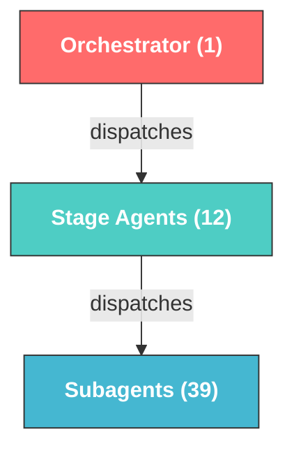
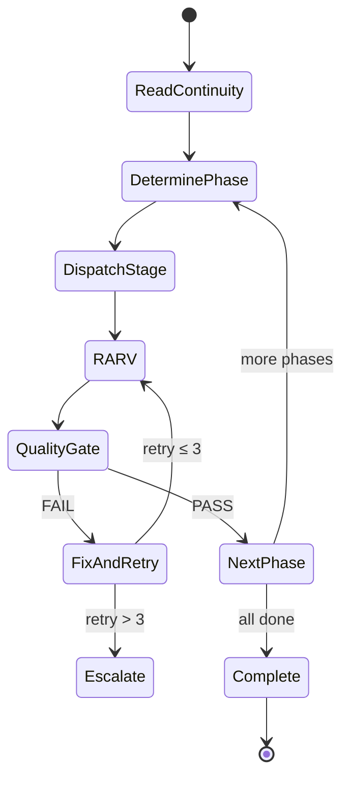
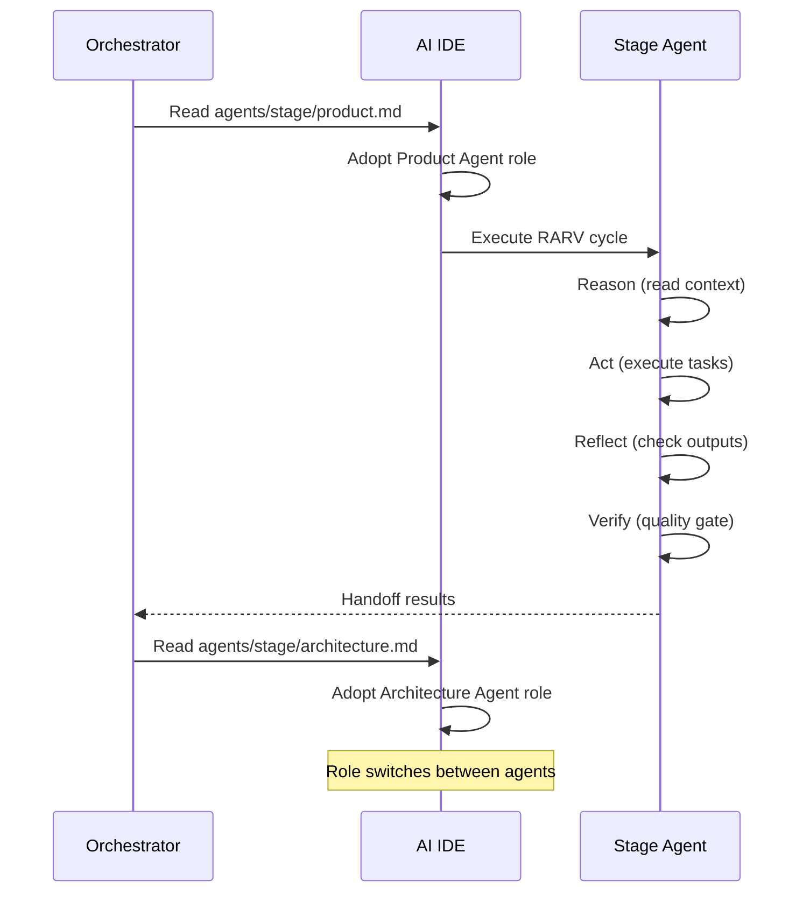
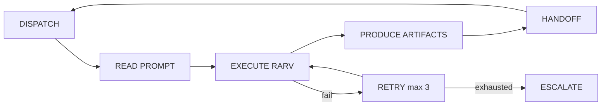

# Agents

## Overview

The framework has **52 agents** in a 3-tier hierarchy: 1 orchestrator, 12 stage agents, and 39 subagents. After every phase, the orchestrator dispatches 3 blind reviewers to assess that phase's artifacts. Every agent is a `.md` file under `.sdlc/framework/agents/`.



## Agent Prompt Structure

Every agent prompt follows this standard format:

```markdown
## GOAL
[What success looks like — measurable outcome]

## CONSTRAINTS
[Hard limits — what you cannot do]

## CONTEXT
[Files to read, previous attempts, related decisions]

## OUTPUT
[Exact deliverables expected — file paths, formats]
```

## Orchestrator

| Field | Value |
|-------|-------|
| **ID** | `orch-sdlc` |
| **File** | `.sdlc/framework/agents/orchestrator.md` |
| **Role** | Workflow control, phase transitions, task delegation, quality gate enforcement |
| **Dispatches** | All 12 stage agents sequentially (Phase 12 Retirement dispatched only when triggered) |

The orchestrator:
- Reads `AGENTS.md` to discover available agents
- Reads `CONTINUITY.md` at the start of every turn
- Drives the RARV cycle (Reason → Act → Reflect → Verify)
- Enforces quality gates between phases
- Manages error handling and retry logic



## Stage Agents

| Phase | Agent | ID | File | Subagents |
|-------|-------|----|------|-----------|
| 0 | Problem Discovery | `stage-problem-discovery` | `agents/stage/problem-discovery.md` | 4 |
| 2 | Product | `stage-product` | `agents/stage/product.md` | 4 |
| 3 | Story-Tasks | `stage-story-tasks` | `agents/stage/story-tasks.md` | 3 |
| 4 | Architecture | `stage-architecture` | `agents/stage/architecture.md` | 3 |
| 5 | Design | `stage-design` | `agents/stage/design.md` | 4 |
| 6 | Development | `stage-development` | `agents/stage/development.md` | 4 |
| 7 | Testing | `stage-testing` | `agents/stage/testing.md` | 4 |
| 8 | Security | `stage-security` | `agents/stage/security.md` | 4 |
| 9 | Review | `stage-review` | `agents/stage/review.md` | 3 |
| 10 | DevOps | `stage-devops` | `agents/stage/devops.md` | 0 |
| 11 | Observability | `stage-observability` | `agents/stage/observability.md` | 0 |
| 12 | Retirement (triggered) | `stage-retirement` | `agents/stage/retirement.md` | 4 |

(Phase 1: Bootstrap is handled directly by `orch-sdlc`, no dedicated stage agent.)

## Subagents by Stage

### Product Subagents (4)

| Agent | ID | File | Task |
|-------|----|------|------|
| Requirement Parser | `sub-requirement-parser` | `agents/sub/product/requirement-parser.md` | Parse raw input into structured requirements |
| Acceptance Criteria Generator | `sub-acceptance-criteria` | `agents/sub/product/acceptance-criteria-generator.md` | Generate testable Given/When/Then criteria |
| Risk Analyzer | `sub-risk-analyzer` | `agents/sub/product/risk-analyzer.md` | Identify risks with severity and mitigations |
| Assumption Extractor | `sub-assumption-extractor` | `agents/sub/product/assumption-extractor.md` | Surface hidden assumptions in specs |

### Story-Tasks Subagents (3)

| Agent | ID | File | Task |
|-------|----|------|------|
| Story Writer | `sub-story-writer` | `agents/sub/story-tasks/story-writer.md` | Decompose requirements into user stories |
| Task Decomposer | `sub-task-decomposer` | `agents/sub/story-tasks/task-decomposer.md` | Break stories into implementable tasks |
| Dependency Mapper | `sub-dependency-mapper` | `agents/sub/story-tasks/dependency-mapper.md` | Build dependency graph & critical path |

### Architecture Subagents (3) — ADR-Focused

| Agent | ID | File | Task |
|-------|----|------|------|
| Tech Stack Advisor | `sub-tech-stack-advisor` | `agents/sub/architecture/tech-stack-advisor.md` | Technology stack recommendation |
| Solution Evaluator | `sub-solution-evaluator` | `agents/sub/architecture/solution-evaluator.md` | Alternative solution trade-off analysis |
| ADR Writer | `sub-adr-writer` | `agents/sub/architecture/adr-writer.md` | Architecture Decision Records |

### Design Subagents (4)

| Agent | ID | File | Task |
|-------|----|------|------|
| Interface Designer | `sub-interface-designer` | `agents/sub/design/interface-designer.md` | Design interface contracts (APIs, CLIs, UIs, events, protocols) |
| Data Model Designer | `sub-data-model-designer` | `agents/sub/design/data-model-designer.md` | Data/state models (databases, files, in-memory, event stores) |
| Integration Planner | `sub-integration-planner` | `agents/sub/design/integration-planner.md` | External system integrations |
| NFR Evaluator | `sub-nfr-evaluator` | `agents/sub/design/nfr-evaluator.md` | Non-functional requirements evaluation |

### Development Subagents (4)

| Agent | ID | File | Task |
|-------|----|------|------|
| Repo Analyzer | `sub-repo-analyzer` | `agents/sub/development/repo-analyzer.md` | Analyze codebase patterns and conventions |
| Code Generator | `sub-code-generator` | `agents/sub/development/code-generator.md` | Implement features from task definitions |
| Refactoring Agent | `sub-refactoring-agent` | `agents/sub/development/refactoring-agent.md` | Refactor for quality and maintainability |
| Documentation Agent | `sub-documentation-agent` | `agents/sub/development/documentation-agent.md` | Generate code and API documentation |

### Testing Subagents (4)

| Agent | ID | File | Task |
|-------|----|------|------|
| Unit Test Agent | `sub-unit-test` | `agents/sub/testing/unit-test-agent.md` | Unit tests with ≥80% coverage target |
| Integration Test Agent | `sub-integration-test` | `agents/sub/testing/integration-test-agent.md` | Component interaction tests |
| Regression Test Agent | `sub-regression-test` | `agents/sub/testing/regression-test-agent.md` | Map acceptance criteria to regression tests |
| Test Data Generator | `sub-test-data` | `agents/sub/testing/test-data-generator.md` | Fixtures, mocks, factory functions |

### Security Subagents (4)

| Agent | ID | File | Task |
|-------|----|------|------|
| Secret Scanner | `sub-secret-scanner` | `agents/sub/security/secret-scanner.md` | Detect hardcoded secrets, API keys, tokens |
| Dependency Scanner | `sub-dependency-scanner` | `agents/sub/security/dependency-scanner.md` | Audit dependencies for CVEs |
| OWASP Reviewer | `sub-owasp-reviewer` | `agents/sub/security/owasp-reviewer.md` | OWASP Top 10 review |
| Policy Validator | `sub-policy-validator` | `agents/sub/security/policy-validator.md` | Security policy compliance |

### Review Subagents (3)

| Agent | ID | File | Task |
|-------|----|------|------|
| Code Review Agent | `sub-code-review` | `agents/sub/review/code-review-agent.md` | Code quality, SOLID, best practices |
| Maintainability Reviewer | `sub-maintainability` | `agents/sub/review/maintainability-reviewer.md` | Tech debt, complexity, readability |
| Performance Reviewer | `sub-performance` | `agents/sub/review/performance-reviewer.md` | Bottlenecks, optimization opportunities |

### Problem Discovery Subagents (4)

| Agent | ID | File | Task |
|-------|----|------|------|
| Problem Statement Extractor | `sub-problem-statement-extractor` | `agents/sub/problem-discovery/problem-statement-extractor.md` | Parse vague input into a clear problem statement |
| User Research Synthesizer | `sub-user-research-synthesizer` | `agents/sub/problem-discovery/user-research-synthesizer.md` | Validate problem severity via evidence |
| Opportunity Analyzer | `sub-opportunity-analyzer` | `agents/sub/problem-discovery/opportunity-analyzer.md` | Business case / ROI assessment |
| Solution Space Explorer | `sub-solution-space-explorer` | `agents/sub/problem-discovery/solution-space-explorer.md` | Build vs. buy vs. don't-build |

### Retirement Subagents (4)

| Agent | ID | File | Task |
|-------|----|------|------|
| Deprecation Planner | `sub-deprecation-planner` | `agents/sub/retirement/deprecation-planner.md` | Timeline, communication, stakeholder mgmt |
| Migration Strategist | `sub-migration-strategist` | `agents/sub/retirement/migration-strategist.md` | User migration to replacement systems |
| Data Retention Auditor | `sub-data-retention-auditor` | `agents/sub/retirement/data-retention-auditor.md` | GDPR/HIPAA compliant data deletion |
| Decommission Executor | `sub-decommission-executor` | `agents/sub/retirement/decommission-executor.md` | Infrastructure removal, dependency cleanup |

### Cross-Cutting Subagents (2)

| Agent | ID | File | Task |
|-------|----|------|------|
| Compliance Validator | `sub-compliance-validator` | `agents/sub/compliance/compliance-validator.md` | GDPR/HIPAA/SOX/PCI-DSS checks (Phases 5, 8, 12) |
| Context Optimizer | `sub-context-optimizer` | `agents/sub/context-optimizer.md` | Compress CONTINUITY.md working memory |

## Agent Execution Model

Agents execute via **role switching** — the AI IDE reads the agent's `.md` prompt and adopts that persona:



## Agent Lifecycle



## Complexity-Based Selection

Not all subagents run for every project:

| Complexity | Detection | Subagents Used |
|------------|-----------|----------------|
| **Simple** | < 5 requirements, single service | Parser + Code Generator + Unit Test |
| **Medium** | 5–15 requirements, 2–3 services | Core subagents per stage |
| **Complex** | 15–50 requirements, microservices | All subagents |
| **Enterprise** | 50+ requirements, distributed | All subagents + extended review |

## Handoff Protocol

When one agent passes work to another:

```json
{
  "from": "stage-product",
  "to": "stage-story-tasks",
  "phase": "product → story-tasks",
  "completed_work": "Requirements parsed, acceptance criteria generated",
  "artifacts_produced": [
    ".sdlc/artifacts/product/requirements.md",
    ".sdlc/artifacts/product/acceptance-criteria.md"
  ],
  "decisions_made": ["REST over GraphQL", "PostgreSQL for persistence"],
  "open_questions": [],
  "mistakes_learned": []
}
```
