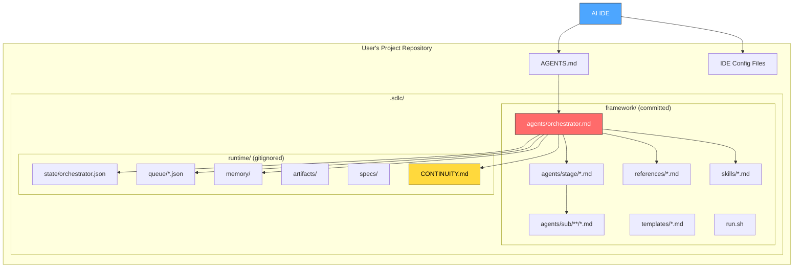
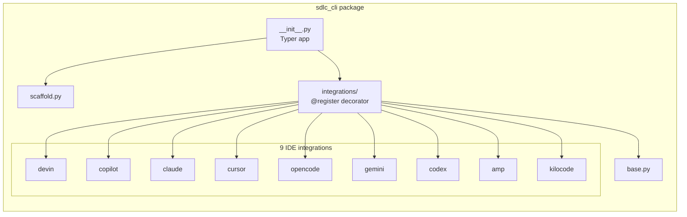
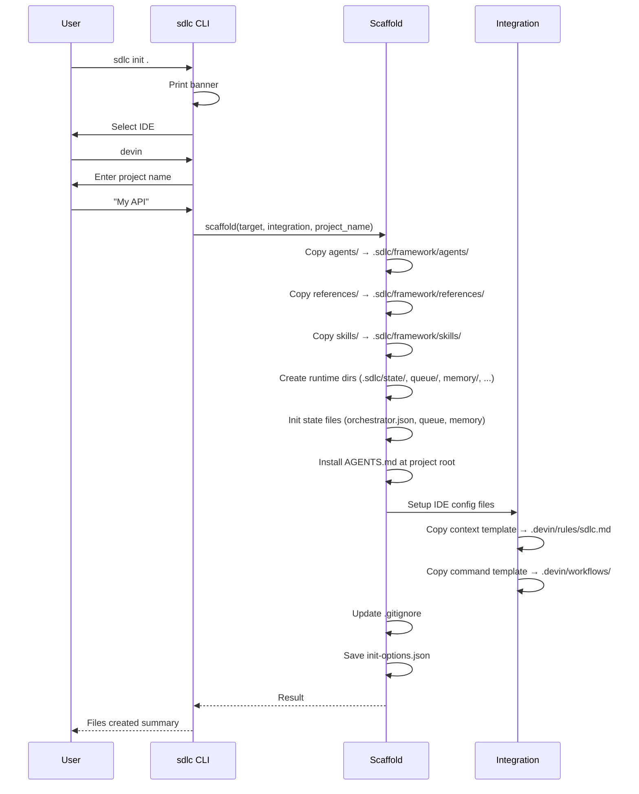
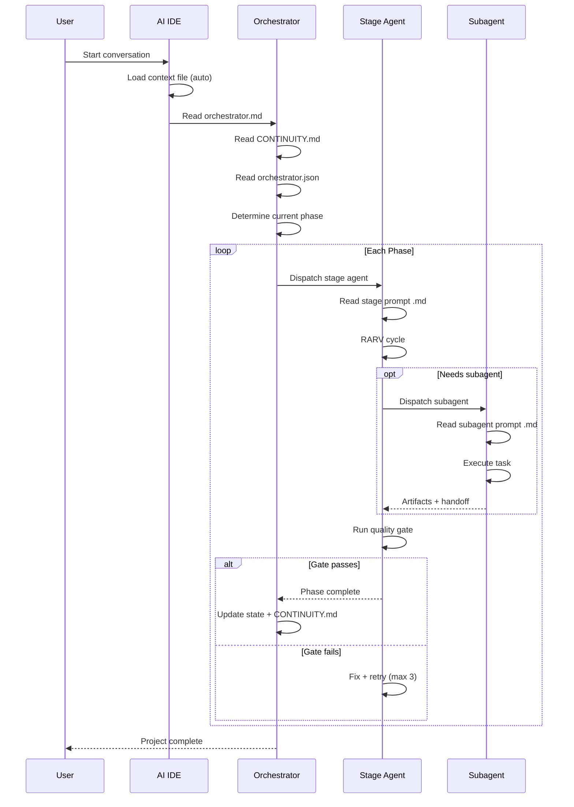

# Architecture

## System Overview

The Autonomous SDLC Framework is a **markdown-driven multi-agent system** that executes the full software development lifecycle inside any AI IDE. It has no runtime dependencies — agents are `.md` files that the AI reads and executes.



## Component Model

### 1. Agent Layer (52 agents)

Agents are markdown prompt files organized in a 3-tier hierarchy:

```mermaid
graph TD
    O[Orchestrator<br/>1 agent] --> S1[Product]
    O --> S2[Story-Tasks]
    O --> S3[Architecture]
    O --> S4[Design]
    O --> S5[Development]
    O --> S6[Testing]
    O --> S7[Security]
    O --> S8[Review]
    O --> S9[DevOps]
    O --> S10[Observability]

    S1 --> S1A[Requirement Parser]
    S1 --> S1B[Acceptance Criteria]
    S1 --> S1C[Risk Analyzer]
    S1 --> S1D[Assumption Extractor]

    S2 --> S2A[Story Writer]
    S2 --> S2B[Task Decomposer]
    S2 --> S2C[Dependency Mapper]

    S3 --> S3A[Tech Stack Advisor]
    S3 --> S3B[Solution Evaluator]
    S3 --> S3C[ADR Writer]

    S4 --> S4A[Interface Designer]
    S4 --> S4B[Data Model Designer]
    S4 --> S4C[Integration Planner]
    S4 --> S4D[NFR Evaluator]

    S5 --> S5A[Repo Analyzer]
    S5 --> S5B[Code Generator]
    S5 --> S5C[Refactoring Agent]
    S5 --> S5D[Documentation Agent]

    S6 --> S6A[Unit Test]
    S6 --> S6B[Integration Test]
    S6 --> S6C[Regression Test]
    S6 --> S6D[Test Data Generator]

    S7 --> S7A[Secret Scanner]
    S7 --> S7B[Dependency Scanner]
    S7 --> S7C[OWASP Reviewer]
    S7 --> S7D[Policy Validator]

    S8 --> S8A[Code Review]
    S8 --> S8B[Maintainability]
    S8 --> S8C[Performance]

    style O fill:#ff6b6b,stroke:#333,color:#fff
    style S1 fill:#4ecdc4,stroke:#333,color:#fff
    style S2 fill:#4ecdc4,stroke:#333,color:#fff
    style S3 fill:#4ecdc4,stroke:#333,color:#fff
    style S4 fill:#4ecdc4,stroke:#333,color:#fff
    style S5 fill:#4ecdc4,stroke:#333,color:#fff
    style S6 fill:#4ecdc4,stroke:#333,color:#fff
    style S7 fill:#4ecdc4,stroke:#333,color:#fff
    style S8 fill:#4ecdc4,stroke:#333,color:#fff
    style S9 fill:#4ecdc4,stroke:#333,color:#fff
    style S10 fill:#4ecdc4,stroke:#333,color:#fff
```



### 2. State Layer

All runtime state lives under `.sdlc/` (gitignored):

| Component | File | Purpose |
|-----------|------|---------|
| Orchestrator state | `state/orchestrator.json` | Phase progress, task counts, status |
| Task queue | `queue/{pending,active,completed}.json` | Task lifecycle tracking |
| Working memory | `CONTINUITY.md` | Current session context, read/written every turn |
| Episodic memory | `memory/episodic/` | Per-task execution traces |
| Semantic memory | `memory/semantic/` | Generalized patterns and anti-patterns |
| Learnings | `memory/learnings/` | Extracted from errors for prevention |
| Artifacts | `artifacts/<phase>/` | Generated outputs per phase |
| Specs | `specs/` | Normalized input specifications |

### 3. CLI Layer (Python package)

The CLI bootstraps the framework into any repo:



### 4. Distribution Model

```mermaid
flowchart LR
    REPO[GitHub Repo] -->|"pip install / uvx"| PKG[Python Package]
    PKG -->|"sdlc init ."| TARGET[User's Project]

    subgraph PKG [Package Contents]
        PY[Python CLI code]
        AGENTS[agents/*.md]
        REFS2[references/*.md]
        SKILLS2[skills/*.md]
        TMPL[templates/*.md]
        EXAMPLES[examples/]
        RUN[run.sh]
    end

    subgraph TARGET [Scaffolded Output]
        FW[".sdlc/framework/"]
        RT[".sdlc/ runtime dirs"]
        AGT["AGENTS.md"]
        IDE2["IDE config files"]
    end
```



The `pyproject.toml` uses `hatchling` with `force-include` to bundle all framework files into the wheel:

```
agents/         → sdlc_cli/core_pack/agents/
references/     → sdlc_cli/core_pack/references/
skills/         → sdlc_cli/core_pack/skills/
templates/      → sdlc_cli/core_pack/templates/
examples/       → sdlc_cli/core_pack/examples/
run.sh          → sdlc_cli/core_pack/run.sh
```

## Data Flow

### Initialization Flow



### Runtime Flow (Agent Execution)



## Design Principles

1. **Zero runtime dependencies** — No framework process, no server. Agents are markdown files.
2. **IDE-native** — Uses each IDE's native config system (rules, instructions, agents).
3. **Portable** — Single `.sdlc/` directory. Move it, fork it, customize it.
4. **Observable** — All state is JSON/Markdown. Human-readable, git-friendly.
5. **Composable** — Use all 52 agents or cherry-pick individual stages.
6. **Memory-driven** — Agents learn from mistakes via the 3-tier memory system.
