# CLI Reference

## Installation

```bash
# One-time (no install)
uvx --from git+https://github.com/bitbitcodes/autonomous-sdlc.git sdlc init .

# Persistent install
pip install git+https://github.com/bitbitcodes/autonomous-sdlc.git

# Development install
git clone https://github.com/bitbitcodes/autonomous-sdlc.git
cd autonomous-sdlc
pip install -e ".[test,dev]"
```

**Requirements:** Python 3.11+

## Conventions

Most commands accept an optional `[TARGET]` — the **project directory** containing `.sdlc/`. Omit it to use the current working directory, or pass a path to operate on another project (e.g. `sdlc status ./my-app`). In usage lines, `[...]` marks optional arguments and `<...>` marks required ones.

## Commands

### `sdlc init`

Initialize the autonomous-sdlc agent framework in a directory.

```bash
sdlc init [TARGET] [OPTIONS]
```

**Arguments:**

| Argument | Description | Default |
|----------|-------------|---------|
| `TARGET` | Target directory path | Current directory |

**Options:**

| Flag | Short | Description | Default |
|------|-------|-------------|---------|
| `--integration` | `-i` | AI IDE integration key | (interactive) |
| `--project-name` | `--name` | Project name for templates | Directory name |
| `--tech-stack` | | Tech stack context | (empty) |
| `--team-size` | | Team size context | (empty) |
| `--force` | `-f` | Overwrite existing files | `false` |
| `--non-interactive` | `-y` | Skip prompts, use defaults | `false` |
| `--here` | | Init in current directory | `false` |

**Integration keys:**

| Key | IDE |
|-----|-----|
| `copilot` | GitHub Copilot |
| `devin` | Devin Desktop (`windsurf` kept as a back-compat alias) |
| `claude` | Claude Code |
| `cursor-agent` | Cursor |
| `opencode` | opencode |
| `gemini` | Gemini CLI |
| `codex` | Codex CLI |
| `amp` | Amp |
| `kilocode` | Kilo Code |

**Examples:**

```bash
# Interactive mode (default)
sdlc init .

# Non-interactive with all options
sdlc init . \
  --integration devin \
  --project-name "Task API" \
  --tech-stack "Python, FastAPI, PostgreSQL" \
  --team-size "3 developers" \
  --non-interactive

# Force overwrite existing
sdlc init . --force --integration copilot -y

# Init in current directory
sdlc init --here
```

### `sdlc status`

Show the current SDLC workflow status — phases, agents, and progress.

```bash
sdlc status [TARGET]
```

**Arguments:**

| Argument | Description | Default |
|----------|-------------|--------|
| `TARGET` | Project directory path | Current directory |

**Output includes:**

| Section | Source | Description |
|---------|--------|-------------|
| Agent Dashboard | `STATUS.md` | Tabular status of all phases, agents, and subagents |
| Current State | `orchestrator.json` | Phase progress, complexity, task counts |
| Phase Progress | `orchestrator.json` | Rich table with status icons and gate results |
| Queue | `queue/*.json` | Pending / active / completed task counts |
| Activity Log | `activity-log.md` | Last 15 lines of agent actions |
| Working Memory | `CONTINUITY.md` | Current phase, tasks, next steps |

**Examples:**

**Options:**

| Flag | Short | Description | Default |
|------|-------|-------------|--------|
| `--run` | `-r` | Run name/slug (default: active run) | (active) |

```bash
# From inside the project
sdlc status

# Pointing to a specific project
sdlc status /path/to/my-project

# Status for a specific run
sdlc status --run user-auth-jwt-tokens
```

### `sdlc trace`

Show the agent interaction map — which agent did what, dispatched whom, and artifact flow.

```bash
sdlc trace [TARGET] [OPTIONS]
```

**Arguments:**

| Argument | Description | Default |
|----------|-------------|---------|
| `TARGET` | Project directory path | Current directory |

**Options:**

| Flag | Short | Description | Default |
|------|-------|-------------|---------|
| `--phase` | `-p` | Filter to a specific phase number | (all) |
| `--verify` | `-v` | Cross-check traced artifacts against files on disk | `false` |
| `--run` | `-r` | Run name/slug (default: active run) | (active) |
| `--diagram` | `-d` | Write Mermaid agent-map.md alongside trace output | `false` |

**Output includes:**

| Section | Description |
|---------|-------------|
| Interaction Tree | Rich tree showing orchestrator → stage → subagent hierarchy |
| Artifact Flow | Input/output artifacts for each agent |
| Gate Results | Quality gate pass/fail per phase |
| Verification | (with `--verify`) Confirms artifacts exist on disk, flags missing |

**Examples:**

```bash
# Full interaction map
sdlc trace

# Filter to Phase 1 (Product)
sdlc trace --phase 1

# Verify all traced artifacts exist on disk
sdlc trace --verify

# Combine: check Phase 5 artifacts
sdlc trace --phase 5 --verify

# Generate Mermaid diagram file
sdlc trace --diagram
```

**Data source:** `.sdlc/state/agent-trace.json` — populated by the orchestrator and stage agents during execution. Each entry records the agent ID, role (orchestrator/stage/subagent), parent-child relationship, input/output artifacts, and dispatched agents.

### `sdlc run`

Manage multiple SDLC runs (specs/use-cases) within the same repository. Each run gets isolated state, queue, memory, artifacts, and specs under `.sdlc/runs/<auto-slug>/`. The framework files in `.sdlc/framework/` are shared.

#### `sdlc run new`

Create a new named run from a spec file. The folder name is **auto-generated** from the spec content (3-4 descriptive keywords).

```bash
sdlc run new [SPEC_FILE] [OPTIONS]
```

| Option | Short | Description |
|--------|-------|-------------|
| `--name` | `-n` | Override the auto-generated folder name |
| `--target` | `-t` | Project directory (default: current) |

**Examples:**

```bash
# Auto-name from spec content
sdlc run new ./specs/auth-api.md
# → creates .sdlc/runs/user-auth-jwt-tokens/

# Override the name
sdlc run new ./specs/auth-api.md --name my-auth-run

# No spec file — prompts for a title
sdlc run new
```

**Auto-naming:** Extracts the first heading or first line from the spec, strips stopwords, and joins 3-4 keywords with hyphens. If a slug already exists, appends `-2`, `-3`, etc.

#### `sdlc run list`

List all runs with status, current phase, and last updated time.

```bash
sdlc run list
```

#### `sdlc run switch`

Set the active run. All commands (`status`, `trace`, `dashboard`) will operate on the active run by default.

```bash
sdlc run switch <SLUG>
```

#### `sdlc run active`

Show the currently active run.

```bash
sdlc run active
```

#### `sdlc run archive`

Move a completed run to `.sdlc/archive/<slug>/`.

```bash
sdlc run archive <SLUG>
```

**Folder structure with runs:**

```
project/
  .sdlc/
    framework/                    # shared (committed)
    model-config.json             # shared (committed)
    active-run.json               # tracks current run slug
    runs/
      user-auth-jwt-tokens/       # auto-generated
        state/ queue/ memory/ artifacts/ specs/
        CONTINUITY.md
        run-info.json
      stripe-payment-webhook/
        state/ queue/ memory/ artifacts/ specs/
        CONTINUITY.md
        run-info.json
```

### `sdlc upgrade`

Upgrade `.sdlc/framework/` files from the installed package without touching runtime state, runs, or config.

```bash
sdlc upgrade [TARGET] [OPTIONS]
```

**Arguments:**

| Argument | Description | Default |
|----------|-------------|---------|
| `TARGET` | Project directory path | Current directory |

**Options:**

| Flag | Description | Default |
|------|-------------|---------|
| `--dry-run` | Show what would change without writing | `false` |

**What gets updated:**
- `.sdlc/framework/agents/`, `references/`, `skills/`, `templates/`, `examples/`
- `.sdlc/framework/run.sh`
- `AGENTS.md` (project root)

**What is NOT touched:**
- Runtime state (`state/`, `queue/`, `memory/`, `artifacts/`, `specs/`)
- Runs (`.sdlc/runs/`, `.sdlc/archive/`)
- Config (`model-config.json`, `init-options.json`, `active-run.json`)
- `CONTINUITY.md`, IDE config files

**Examples:**

```bash
# Upgrade after pip install --upgrade autonomous-sdlc
sdlc upgrade

# Preview changes first
sdlc upgrade --dry-run
```

### `sdlc dashboard`

Launch a real-time web dashboard that auto-updates as agents execute.

```bash
sdlc dashboard [TARGET] [OPTIONS]
```

**Arguments:**

| Argument | Description | Default |
|----------|-------------|---------|
| `TARGET` | Project directory path | Current directory |

**Options:**

| Flag | Short | Description | Default |
|------|-------|-------------|---------|
| `--port` | `-p` | HTTP server port (WebSocket = port+1) | `8420` |

**Requirements:** `pip install autonomous-sdlc[dashboard]` (adds `websockets` package)

**Dashboard sections:**

| Section | Data Source | Description |
|---------|------------|-------------|
| Phase Progress | `orchestrator.json` | Colored pill badges per phase |
| Agent Interaction Map | `agent-trace.json` | Live tree of agent dispatches |
| Active Agent | `orchestrator.json` | Currently running agent |
| Task Queue | `queue/*.json` | Pending/active/completed bars |
| Activity Feed | `activity-log.md` | Last 30 lines of agent actions |
| Working Memory | `CONTINUITY.md` | Current context |

**Examples:**

```bash
# Launch dashboard (opens browser automatically)
sdlc dashboard

# Custom port
sdlc dashboard --port 9000

# Point to a different project
sdlc dashboard /path/to/my-project
```

### `sdlc models`

Show or manage per-agent model routing configuration.

```bash
sdlc models [TARGET] [--edit] [--reset]
```

**Arguments:**

| Argument | Description |
|----------|-------------|
| `TARGET` | Project directory (default: current directory) |

**Options:**

| Option | Description |
|--------|-------------|
| `--edit, -e` | Open `model-config.json` in `$EDITOR` |
| `--reset` | Reset model config to defaults |

**Model Tiers:**

The framework uses 3 capability tiers to assign models to agents:

| Tier | Default Model | Purpose |
|------|---------------|---------|
| `reasoning` | `claude-opus-4.7` | Complex analysis, planning, architecture decisions |
| `coding` | `claude-sonnet-4.6` | Code generation, test writing, infrastructure |
| `fast` | `claude-haiku-4.5` | Focused subtasks, parsing, data extraction |

**Default Assignments:**

| Agent Tier | Agents |
|------------|--------|
| `reasoning` | `orch-sdlc`, `stage-product`, `stage-story-tasks`, `stage-architecture`, `stage-design`, `stage-security`, `stage-review` |
| `coding` | `stage-development`, `stage-testing`, `stage-devops`, `stage-observability` |
| `fast` | All `sub-*` subagents |

**Config File:** `.sdlc/model-config.json` (committed, not gitignored)

```json
{
  "tiers": {
    "reasoning": "claude-opus-4.7",
    "coding": "claude-sonnet-4.6",
    "fast": "claude-haiku-4.5"
  },
  "agent_tiers": {
    "orch-sdlc": "reasoning",
    "stage-development": "coding",
    "sub-*": "fast"
  },
  "overrides": {
    "sub-code-generator": "claude-sonnet-4"
  }
}
```

**Resolution order:** `overrides[agent_id]` → `tiers[agent_tiers[agent_id]]` → `tiers[agent_tiers["sub-*"]]` → `tiers["fast"]`

**IDE-Native Support:**

| IDE | Model Switching |
|-----|-----------------|
| **Cursor** | Per-stage `.mdc` files with `model:` frontmatter (auto-generated) |
| **Others** | `## MODEL` hint in dispatch prompt for manual switching |

**Examples:**

```bash
# View current model assignments
sdlc models

# Edit model config in $EDITOR
sdlc models --edit

# Reset to default tiers
sdlc models --reset

# View models for a specific project
sdlc models /path/to/project
```

### `sdlc phases`

Show or manage which stages and subagents are enabled for this project. Disabled stages are skipped entirely by the orchestrator (no dispatch, no quality gate, no per-phase review); disabled subagents are skipped within an otherwise-enabled stage.

```bash
sdlc phases [TARGET] [OPTIONS]
```

**Arguments:**

| Argument | Description |
|----------|-------------|
| `TARGET` | Project directory (default: current directory) |

**Options:**

| Option | Description |
|--------|-------------|
| `--disable <stage-id>` | Disable an entire stage, e.g. `stage-security` |
| `--enable <stage-id>` | Re-enable a stage |
| `--disable-sub <stage-id>:<sub-id>` | Disable one subagent within a stage, e.g. `stage-testing:sub-regression-test` |
| `--enable-sub <stage-id>:<sub-id>` | Re-enable a subagent |
| `--preset <name>` | Apply a preset profile: `full` or `lean` (see below) |
| `--edit, -e` | Open `phase-config.json` in `$EDITOR` |
| `--reset` | Reset phase config to defaults (everything enabled) |

**Presets:**

| Preset | Enabled stages | Disabled stages |
|--------|----------------|-----------------|
| `full` | All (same as `--reset`) | None |
| `lean` | Product, Story-Tasks, Architecture, Design, Development, Testing, Review, DevOps (+ Bootstrap, always on) | Problem Discovery (0), Security (8), Observability (11), Retirement (12) |

The `lean` preset is a non-breaking, opt-in "common core" for typical/prototype builds. `sdlc init` and `--reset` still ship every stage enabled. Applying a preset rewrites `phase-config.json` (subagent selections are preserved, so re-enabling a stage restores its subagents).

**Valid stage-ids** (use these with `--disable` / `--enable`, *not* the phase number or display name):

| Phase | Stage-id |
|-------|----------|
| 0 | `stage-problem-discovery` |
| 2 | `stage-product` |
| 3 | `stage-story-tasks` |
| 4 | `stage-architecture` |
| 5 | `stage-design` |
| 6 | `stage-development` |
| 7 | `stage-testing` |
| 8 | `stage-security` |
| 9 | `stage-review` |
| 10 | `stage-devops` |
| 11 | `stage-observability` |
| 12 | `stage-retirement` |

Phase 1 (Bootstrap) has no stage-id and cannot be disabled. Run `sdlc phases` with no flags to see the current list at any time.

**Config File:** `.sdlc/phase-config.json` (committed, not gitignored)

```json
{
  "stages": {
    "stage-security": {
      "enabled": false,
      "subagents": {
        "sub-secret-scanner": true,
        "sub-dependency-scanner": true,
        "sub-owasp-reviewer": true,
        "sub-policy-validator": true
      }
    },
    "stage-testing": {
      "enabled": true,
      "subagents": {
        "sub-unit-test": true,
        "sub-integration-test": true,
        "sub-regression-test": false,
        "sub-test-data": true
      }
    }
  }
}
```

**Rules:**
- Absent file, absent stage entry, or `enabled: true`/missing → treated as enabled (default, v3.0/v4.0-compatible)
- Disabling a stage implicitly disables all of its subagents regardless of their individual flags
- Phase 1 (Bootstrap) has no stage agent and is never configurable — it always runs
- A disabled phase's status in `orchestrator.json` becomes `"skipped"` (gate: `"skipped"`) rather than `"pass"`/`"fail"` — see `references/sdlc-phases.md`
- No dependency validation is performed — disabling, e.g., Architecture does not block Design from running; it's the user's responsibility to disable sensibly

**Examples:**

```bash
# View current phase/subagent enablement
sdlc phases

# Apply the lean common-core preset (skips Problem Discovery, Security,
# Observability, Retirement)
sdlc phases --preset lean

# Go back to all stages enabled
sdlc phases --preset full

# Skip Security and DevOps entirely for an internal prototype
sdlc phases --disable stage-security
sdlc phases --disable stage-devops

# Keep Testing but skip regression tests specifically
sdlc phases --disable-sub stage-testing:sub-regression-test

# Re-enable a previously disabled stage
sdlc phases --enable stage-security

# Edit phase config in $EDITOR
sdlc phases --edit

# Reset to all-enabled defaults
sdlc phases --reset
```

### `sdlc cost-report`

Show token usage, cost breakdown, retry/gate statistics, and budget status for a run.

```bash
sdlc cost-report [TARGET] [OPTIONS]
```

| Flag | Short | Description |
|------|-------|--------------|
| `--run` | `-r` | Run name/slug (default: active run) |

Reads `.sdlc/state/token-usage.json` and, if present, `.sdlc/governance/budget-policy.yaml` for the budget ceiling.

```bash
sdlc cost-report
sdlc cost-report --run user-auth-jwt-tokens
```

### `sdlc explain`

Explain a logged governance decision — alternatives considered, rationale, approver, and impact.

```bash
sdlc explain <DECISION_ID> [--target TARGET]
```

```bash
sdlc explain DEC-001
```

Reads `.sdlc/governance/decision-log.json`.

### `sdlc approvals`

Manage governance approval requests raised by HIGH/CRITICAL risk decisions (per `.sdlc/governance/risk-policy.yaml`).

```bash
sdlc approvals list [--all] [--target TARGET]
sdlc approvals approve <APPROVAL_ID> [--target TARGET]
sdlc approvals reject <APPROVAL_ID> --reason "..." [--target TARGET]
sdlc approvals configure [--target TARGET]
```

```bash
sdlc approvals list
sdlc approvals approve APPR-001
sdlc approvals reject APPR-002 --reason "Use MySQL instead"
sdlc approvals configure   # interactive Slack/email setup
```

Approve/reject actions append an entry to `.sdlc/governance/decision-log.json`, retrievable via `sdlc explain`.

### `sdlc version`

Print the installed version.

```bash
sdlc version
# autonomous-sdlc 4.0.0
```

## Scaffold Behavior

### What Gets Created

```mermaid
flowchart TD
    INIT["sdlc init ."] --> FW["Copy framework files"]
    INIT --> RT["Create runtime dirs"]
    INIT --> STATE["Init state files"]
    INIT --> AGENTS_MD["Install AGENTS.md"]
    INIT --> IDE["Setup IDE integration"]
    INIT --> GIT["Update .gitignore"]
    INIT --> CFG["Save init-options.json"]

    FW --> FW1[".sdlc/framework/agents/"]
    FW --> FW2[".sdlc/framework/references/"]
    FW --> FW3[".sdlc/framework/skills/"]
    FW --> FW4[".sdlc/framework/templates/"]
    FW --> FW5[".sdlc/framework/examples/"]
    FW --> FW6[".sdlc/framework/run.sh"]

    RT --> RT1[".sdlc/state/"]
    RT --> RT2[".sdlc/queue/"]
    RT --> RT3[".sdlc/memory/"]
    RT --> RT4[".sdlc/artifacts/"]
    RT --> RT5[".sdlc/specs/"]

    STATE --> ST1["orchestrator.json"]
    STATE --> ST2["queue/{pending,active,completed}.json"]
    STATE --> ST3["memory indexes"]
    STATE --> ST4["CONTINUITY.md"]
    STATE --> ST5["STATUS.md"]
    STATE --> ST6["activity-log.md"]
```



### Framework Files (committed)

These are copied from the installed package into `.sdlc/framework/`:

| Directory | Contents |
|-----------|----------|
| `agents/` | 52 agent prompt files (orchestrator + 12 stage + 39 sub) |
| `references/` | 5 reference docs (workflow, phases, agents, memory, quality) |
| `skills/` | 5 skill modules (prompting, dispatch, gates, testing, memory) |
| `templates/` | 3 agent templates (stage, subagent, handoff) |
| `examples/` | 4 sample specs (PRD, YAML, brief, JIRA epic) |
| `run.sh` | Utility runner script |

### Runtime Files (gitignored)

Created under `.sdlc/` and added to `.gitignore`:

| Path | Purpose |
|------|---------|
| `state/orchestrator.json` | Phase progress tracking |
| `queue/{pending,active,completed}.json` | Task lifecycle |
| `memory/episodic/` | Per-task execution traces |
| `memory/semantic/` | Patterns and anti-patterns |
| `memory/learnings/` | Error-driven learning |
| `artifacts/<phase>/` | Generated outputs per phase |
| `specs/` | Normalized input specifications |
| `CONTINUITY.md` | Working memory |
| `STATUS.md` | Agent dashboard — tabular status of all phases, agents, subagents |
| `state/agent-trace.json` | Structured agent interaction trace (powers `sdlc trace`) |
| `state/activity-log.md` | Chronological log of every agent action |

### IDE Config Files

Placed at each IDE's native location:

| IDE | Files Created |
|-----|--------------|
| Devin Desktop | `.devin/rules/sdlc.md`, `.devin/workflows/sdlc.orchestrator.md` |
| Copilot | `.github/copilot-instructions.md`, `.github/agents/sdlc.orchestrator.md` |
| Claude Code | `CLAUDE.md`, `.claude/commands/sdlc-orchestrator.md` |
| Cursor | `.cursor/rules/sdlc.mdc` |
| opencode | `.opencode/instructions.md`, `.opencode/commands/sdlc-orchestrator.md` |
| Gemini | `.gemini/GEMINI.md`, `.gemini/commands/sdlc-orchestrator.md` |
| Codex | `.codex/instructions.md`, `.codex/commands/sdlc-orchestrator.md` |
| Amp | `.amp/instructions.md`, `.amp/commands/sdlc-orchestrator.md` |
| Kilo Code | `.kilocode/instructions.md`, `.kilocode/commands/sdlc-orchestrator.md` |

## run.sh Utility

After init, use `.sdlc/framework/run.sh` to manage the framework:

```bash
# Start with a spec
.sdlc/framework/run.sh start ./your-prd.md
.sdlc/framework/run.sh start "Build a REST API for task management"

# Check status
.sdlc/framework/run.sh status

# Agent interaction trace
.sdlc/framework/run.sh trace

# Real-time web dashboard
.sdlc/framework/run.sh dashboard

# Model routing config
.sdlc/framework/run.sh models
.sdlc/framework/run.sh models --edit
.sdlc/framework/run.sh models --reset

# Reset state (keeps framework files)
.sdlc/framework/run.sh reset
```

## Configuration

Saved in `.sdlc/init-options.json`:

```json
{
  "projectName": "My API",
  "integration": "devin",
  "techStack": "Python, FastAPI, PostgreSQL",
  "teamSize": "3 developers",
  "complexity": "auto"
}
```

## Package Structure

The Python CLI is built with:
- **typer** — CLI framework
- **rich** — Terminal formatting (tables, status spinners, colors)
- **readchar** — Arrow-key interactive selector
- **hatchling** — Build backend
- **websockets** *(optional)* — WebSocket server for `sdlc dashboard`

```
src/sdlc_cli/
├── __init__.py        # Typer app, init/status/trace/dashboard/models commands
├── scaffold.py        # Core scaffold logic
├── models.py          # Per-agent model routing config
├── runs.py            # Multi-run management (slug generation, resolution)
├── mermaid.py         # Mermaid diagram generator for agent interaction map
├── dashboard.py       # WebSocket server + file watcher
├── dashboard_html.py  # Single-page dashboard HTML template
├── banner.py          # ASCII art banner
├── config.py          # Config persistence
├── version.py         # Version string
├── selector.py        # Interactive IDE picker
└── integrations/      # IDE integration registry
    ├── __init__.py    # @register decorator
    ├── base.py        # IntegrationBase, MarkdownIntegration
    └── <ide>/         # One subpackage per IDE
```
