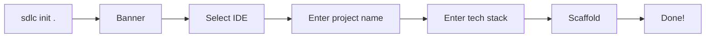
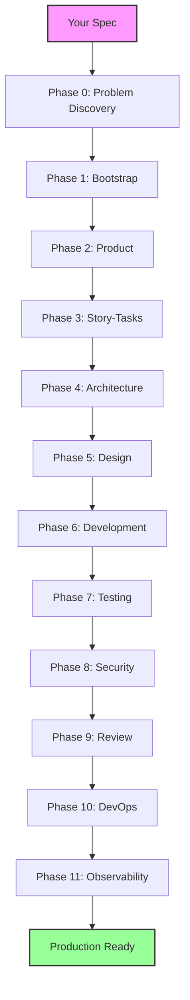

# Getting Started

## Prerequisites

- **Python 3.11+**
- An AI IDE: Devin Desktop (formerly Windsurf), Cursor, GitHub Copilot, Claude Code, opencode, Gemini CLI, Codex CLI, Amp, or Kilo Code
- A git repository (or any directory) where you want to bootstrap the framework

## Installation

### One-Time Usage (no install)

```bash
uvx --from git+https://github.com/bitbitcodes/autonomous-sdlc.git sdlc init .
```

### Persistent Install

```bash
pip install git+https://github.com/bitbitcodes/autonomous-sdlc.git
sdlc init .
```

### Development Install

```bash
git clone https://github.com/bitbitcodes/autonomous-sdlc.git
cd autonomous-sdlc
pip install -e ".[test,dev]"
```

## Your First Run

### 1. Initialize

Run in your project directory:

```bash
sdlc init .
```

This launches an interactive session:



### 2. What Gets Created

```
your-project/
├── .sdlc/
│   ├── framework/          ← Installed by CLI (committed, don't modify)
│   │   ├── agents/         ←   40 agent prompts
│   │   ├── references/     ←   Workflow & architecture docs
│   │   ├── skills/         ←   Skill modules
│   │   ├── templates/      ←   Agent prompt templates
│   │   ├── examples/       ←   Sample specs
│   │   └── run.sh          ←   Utility runner
│   ├── init-options.json   ← Your configuration
│   ├── state/              ← Runtime (gitignored)
│   ├── queue/              ← Runtime (gitignored)
│   ├── memory/             ← Runtime (gitignored)
│   ├── artifacts/          ← Runtime (gitignored)
│   ├── specs/              ← Runtime (gitignored)
│   └── CONTINUITY.md       ← Working memory (gitignored)
├── AGENTS.md               ← Agent discovery file
└── <IDE config files>      ← Devin Desktop rules, Copilot agents, etc.
```

### 3. Select the Orchestrator and Paste Your Spec

The easiest path — no terminal commands needed:

1. Open your AI IDE
2. Select the `sdlc.orchestrator` agent or command
3. Paste your spec (JIRA story, PRD, requirements, or a one-liner) directly into the chat

| IDE | How to Select |
|-----|---------------|
| **Copilot** | Click the agent dropdown → select `sdlc.orchestrator` |
| **Devin Desktop** | Type `/sdlc.orchestrator` in Devin Local chat |
| **Claude Code** | Type `/sdlc-orchestrator` in chat |
| **Cursor** | Context auto-loads; say "start the SDLC orchestrator" |

The orchestrator reads your message, saves it to `.sdlc/specs/normalized-spec.md`, and begins driving all 13 phases autonomously.

**Alternative (for large specs as files):**

```bash
.sdlc/framework/run.sh start ./my-prd.md
.sdlc/framework/run.sh start ./jira-epic.md
.sdlc/framework/run.sh start "Build a REST API for task management with auth"
```

Then open your IDE and select the `sdlc.orchestrator` agent — it picks up the pre-loaded spec.

### 4. Monitor Progress

```bash
sdlc status                       # Rich dashboard in console
.sdlc/framework/run.sh status     # Shell alternative
cat .sdlc/STATUS.md               # Agent dashboard with subagent detail
```

The orchestrator tracks progress across several files:
- **`STATUS.md`** — Tabular dashboard showing every phase, agent, subagent status, and key outcomes
- **`state/activity-log.md`** — Chronological log of every agent action and artifact produced
- **`state/orchestrator.json`** — Machine-readable phase progress
- **`CONTINUITY.md`** — Working memory in plain English

## Non-Interactive Mode

For CI/CD or scripted setups:

```bash
sdlc init . \
  --integration devin \
  --project-name "My API" \
  --tech-stack "Python, FastAPI, PostgreSQL" \
  --team-size "3 developers" \
  --non-interactive
```

## What Happens Next

Once initialized, the AI orchestrator drives the full SDLC autonomously:



See [SDLC Phases](phases.md) for details on each phase.
