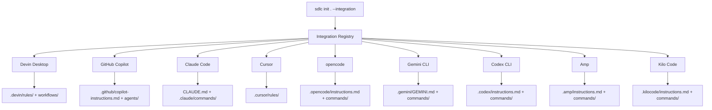
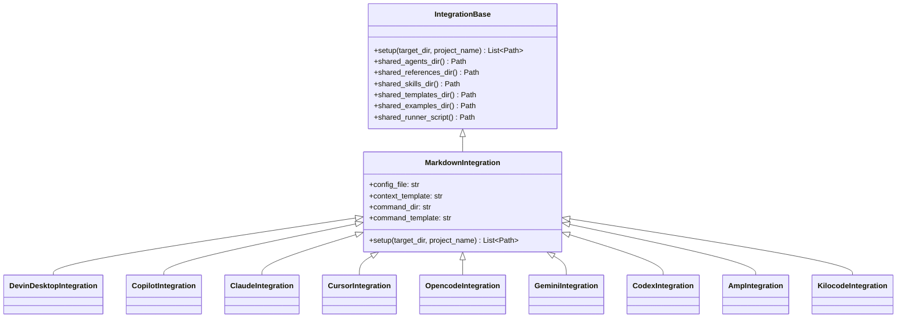

# IDE Integrations

## Overview

The framework supports **9 AI IDEs** through a plugin registry pattern. Each integration places context files and commands at the IDE's native config locations so the orchestrator auto-loads when you start a conversation.



## Supported IDEs

| IDE | Key | Context File | Commands |
|-----|-----|--------------|----------|
| **Devin Desktop** | `devin` | `.devin/rules/sdlc.md` | `.devin/workflows/sdlc.orchestrator.md` |
| **GitHub Copilot** | `copilot` | `.github/copilot-instructions.md` | `.github/agents/sdlc.orchestrator.md` |
| **Claude Code** | `claude` | `CLAUDE.md` | `.claude/commands/sdlc-orchestrator.md` |
| **Cursor** | `cursor-agent` | `.cursor/rules/sdlc.mdc` | `.cursor/rules/` |
| **opencode** | `opencode` | `.opencode/instructions.md` | `.opencode/commands/sdlc-orchestrator.md` |
| **Gemini CLI** | `gemini` | `.gemini/GEMINI.md` | `.gemini/commands/sdlc-orchestrator.md` |
| **Codex CLI** | `codex` | `.codex/instructions.md` | `.codex/commands/sdlc-orchestrator.md` |
| **Amp** | `amp` | `.amp/instructions.md` | `.amp/commands/sdlc-orchestrator.md` |
| **Kilo Code** | `kilocode` | `.kilocode/instructions.md` | `.kilocode/commands/sdlc-orchestrator.md` |

## How It Works

Each IDE integration creates two things:

1. **Context file** — Auto-loaded by the IDE on every conversation. Contains framework overview, RARV cycle summary, and pointers to agent prompts.
2. **Command/workflow file** — A slash command (e.g., `/sdlc.orchestrator`) that launches the full orchestrator.

The context file tells the AI:
- Read `AGENTS.md` for agent discovery
- Read `.sdlc/CONTINUITY.md` for current state
- Load `.sdlc/framework/agents/orchestrator.md` as the primary prompt
- Follow the RARV cycle

## Integration Architecture



All integrations:
- Subclass `MarkdownIntegration`
- Set `config_file`, `context_template`, `command_dir`, `command_template`
- Self-register via `@register("key", "Display Name")` decorator
- Share the same template rendering logic (replaces `{{PROJECT_NAME}}`)

## Adding a New IDE Integration

Create a single file at `src/sdlc_cli/integrations/your_ide/__init__.py`:

```python
from ..base import MarkdownIntegration
from .. import register


@register("your-ide", "Your IDE Name")
class YourIdeIntegration(MarkdownIntegration):
    config_file = ".your-ide/config.md"
    context_template = "generic-instructions.md"
    command_dir = ".your-ide/commands"
    command_template = "commands/orchestrator.md"
```

Then optionally create a custom context template at `templates/your-ide-instructions.md` if the generic one doesn't fit.

**Steps:**
1. Create the integration subpackage
2. Subclass `MarkdownIntegration`
3. Set the 4 path properties
4. Decorate with `@register`
5. (Optional) Add a context template
6. Test: `sdlc init /tmp/test --integration your-ide -y`

The registry auto-discovers the integration — no other file needs editing.

## Template System

IDE context templates live in `templates/` and use `{{PROJECT_NAME}}` as the only placeholder. Each template contains:

- Framework name and version
- RARV cycle overview
- Pointer to `AGENTS.md`
- Pointer to `CONTINUITY.md`
- Agent prompt locations (`.sdlc/framework/agents/`, `.sdlc/framework/references/`, `.sdlc/framework/skills/`)

Templates are IDE-specific because each IDE has different conventions for rule files (markdown, MDC, YAML front matter, etc.).

## Multiple IDEs

You can run `sdlc init` multiple times with different `--integration` flags. Each creates its own IDE-specific files without conflicting:

```bash
sdlc init . --integration devin -y
sdlc init . --integration copilot -y --force
```

The `.sdlc/framework/` directory is shared. Only the IDE config files differ.
