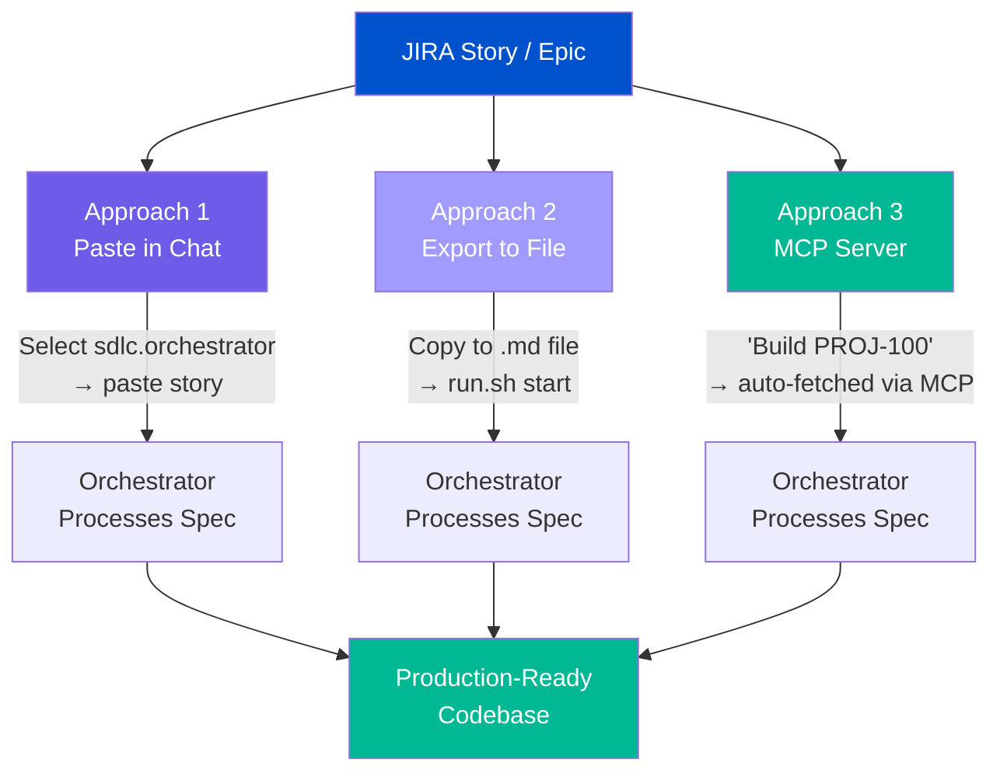
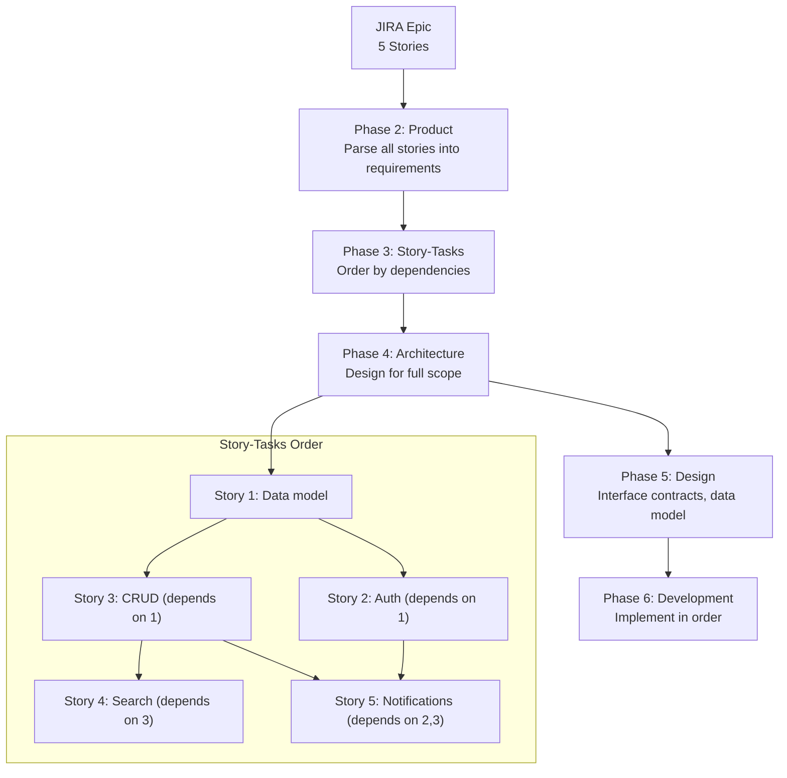
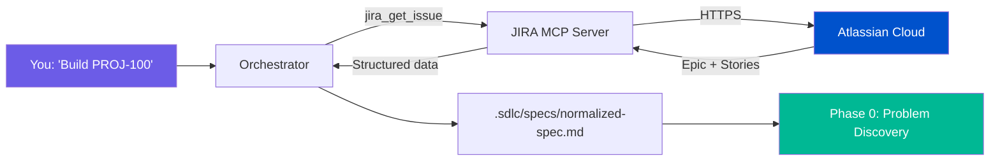

# JIRA Workflow

How to use JIRA epics and stories as input specs for the Autonomous SDLC Framework.

## Overview



| Approach | Best For | Steps |
|----------|----------|-------|
| **Paste in Chat** | Single stories, small epics | Select agent → paste → done |
| **Export to File** | Large epics (10+ stories), repeatable runs | Copy to .md → `run.sh start` → open IDE |
| **MCP Server** | Teams with JIRA MCP configured | Select agent → say "Build PROJ-100" → auto-fetched |

## Approach 1: Paste in Chat (Easiest)

Select `sdlc.orchestrator` from your IDE's agent dropdown and paste your JIRA story directly into the chat. No files, no terminal commands.

### Step-by-Step

1. Open your AI IDE (Copilot, Devin Desktop, Claude Code, Cursor, etc.)
2. Select the `sdlc.orchestrator` agent or command
3. Copy your JIRA story — title, description, acceptance criteria
4. Paste it into the chat and send

The orchestrator automatically:
- Saves your spec to `.sdlc/specs/normalized-spec.md`
- Detects complexity
- Begins Phase 0: Problem Discovery
- Drives all 13 phases

### Example: Single JIRA Story

Select `sdlc.orchestrator`, then paste:

```
PROJ-101 User Registration

As a new user, I want to register with email and password so I can access the platform.

Acceptance Criteria:
- Given a valid email and password (8+ chars, 1 uppercase, 1 number),
  when I POST /api/v1/auth/register, then a 201 response with user ID is returned
- Given a duplicate email, when I POST /api/v1/auth/register,
  then a 409 Conflict is returned
- Given an invalid email format, when I POST /api/v1/auth/register,
  then a 422 with validation errors is returned

Tech Stack: Python 3.12, FastAPI, PostgreSQL
Deployment: Docker on AWS ECS
```

### Example: Small Epic (2–3 Stories)

You can paste multiple stories in a single message:

```
PROJ-100 User Authentication Epic

## Story 1: PROJ-101 Registration
As a new user, I want to register with email and password.
AC:
- POST /api/v1/auth/register with valid data → 201
- Duplicate email → 409

## Story 2: PROJ-102 Login
As a registered user, I want to log in and receive a JWT token.
AC:
- POST /api/v1/auth/login with valid credentials → 200 + JWT
- Invalid credentials → 401

## Story 3: PROJ-103 Password Reset
As a user, I want to reset my password via email.
AC:
- POST /api/v1/auth/forgot-password with email → sends reset email
- POST /api/v1/auth/reset-password with valid token → 200

Tech Stack: Python 3.12, FastAPI, PostgreSQL, Redis
```

### When to Use a File Instead

Use **Approach 2** (file-based) when:
- Your epic has **10+ stories** that won't fit comfortably in a chat message
- You want to **re-run** the framework with the same spec (e.g., after a reset)
- You need the spec in **version control** alongside your code
- Your JIRA stories include **detailed technical context** that's too long for chat

---

## Approach 2: Export to File

Copy your JIRA epic and story details into a markdown file, then feed it via the CLI. Best for large epics.

### Step-by-Step

#### 1. Open Your JIRA Epic

Navigate to the epic in JIRA. You need:
- **Epic title and description**
- **Each story's** title, description, and acceptance criteria
- Any **labels, components, or fix versions** that indicate tech constraints

#### 2. Create a Spec File

Create a markdown file in your project (e.g., `jira-epic.md`) using this template:

```markdown
# [EPIC-KEY] Epic Title

## Epic Description

[Paste the epic description from JIRA]

## Stories

### [STORY-KEY] Story Title

**Description:** [Paste story description]

**Acceptance Criteria:**
- Given [context], when [action], then [result]
- Given [context], when [action], then [result]

**Story Points:** [X]
**Priority:** [Critical/High/Medium/Low]
**Labels:** [label1, label2]

---

### [STORY-KEY] Next Story Title

[Repeat for each story]

## Technical Context

- **Tech Stack:** [Language, framework, database — from JIRA labels or team knowledge]
- **Existing Codebase:** [Yes/No — if yes, describe patterns]
- **Deployment Target:** [Cloud provider, container, serverless]

## Constraints

- [Any constraints from JIRA custom fields, sprint goals, or team agreements]

## Out of Scope

- [Items explicitly excluded or deferred to future sprints]
```

#### 3. Feed to Framework

```bash
.sdlc/framework/run.sh start ./jira-epic.md
```

#### 4. Open Your AI IDE

Start a conversation. The orchestrator picks up the JIRA-sourced spec and processes it through all 13 phases.

### Example

See [`examples/sample-jira-epic.md`](../examples/sample-jira-epic.md) for a complete, realistic example of a JIRA epic converted to a framework-compatible spec.

## Mapping JIRA Fields to Spec Sections

| JIRA Field | Spec Section | Notes |
|------------|-------------|-------|
| Epic Summary | `# Epic Title` | Used as project name |
| Epic Description | `## Epic Description` | Main requirements source |
| Story Summary | `### Story Title` | Becomes a feature/requirement |
| Story Description | `**Description:**` | Detailed requirement |
| Acceptance Criteria | `**Acceptance Criteria:**` | Maps directly to test generation in Phase 6 |
| Story Points | `**Story Points:**` | Helps complexity detection |
| Priority | `**Priority:**` | Influences task ordering in story-tasks phase |
| Labels | `**Labels:**` | Used for tech stack detection |
| Components | `## Technical Context` | Maps to architecture decisions |
| Fix Version | `## Constraints` | Deadline/release constraints |
| Custom Fields | `## Constraints` or `## Technical Context` | Map as appropriate |

## Single Story vs. Epic

### When to Use a Single Story

Use a single JIRA story when:
- The story is self-contained (e.g., "Build user authentication API")
- It has clear acceptance criteria
- It represents a full feature, not a subtask

```markdown
# AUTH-42 User Authentication API

## Description
Build JWT-based authentication with register, login, and password reset endpoints.

## Acceptance Criteria
- Given a new user, when they POST /register with email and password, then a 201 response with user ID is returned
- Given valid credentials, when they POST /login, then a JWT token is returned
- Given an expired token, when they access a protected endpoint, then a 401 is returned

## Technical Context
- Tech Stack: Node.js, Express, PostgreSQL, Prisma
- Existing Codebase: No (greenfield)
```

```bash
.sdlc/framework/run.sh start ./auth-story.md
```

### When to Use an Epic

Use a JIRA epic when:
- Multiple stories form a coherent feature set
- Stories have dependencies between them
- You want the framework to handle the full scope

The framework will:
1. Parse all stories into structured requirements (Phase 2)
2. Decompose into stories/tasks with dependency mapping (Phase 3)
3. Define architecture and ADRs (Phase 4)
4. Detailed design (Phase 5)
5. Implement stories in dependency order (Phase 6)



## Tips for JIRA-Sourced Specs

### Include Acceptance Criteria

This is the **single most impactful thing** you can do. When your JIRA stories have clear Given/When/Then acceptance criteria, the framework:
- Uses them directly in Phase 1 (no guessing)
- Maps them to test cases in Phase 6
- Validates implementation against them in Phase 8

### Add Technical Context

JIRA stories often assume the reader knows the team's tech stack. The framework doesn't have that context unless you add it:

```markdown
## Technical Context
- Language: Python 3.12
- Framework: FastAPI
- Database: PostgreSQL 16 with SQLAlchemy
- Auth: JWT with python-jose
- Testing: pytest
- Deployment: Docker on AWS ECS
```

### Include Out-of-Scope

JIRA epics usually have a scope boundary, but it's implicit. Make it explicit:

```markdown
## Out of Scope
- Frontend (handled by another team)
- Email service (using existing SendGrid integration)
- Payment processing (deferred to Sprint 12)
```

### Handle Sub-Tasks

If your JIRA stories have sub-tasks, you can include them as bullet points under each story — but the framework's story-tasks phase will create its own task breakdown anyway. It's usually enough to include stories only.

## Bulk Export from JIRA

### Manual Copy (Small Epics)

For epics with < 10 stories, manually copy-paste is fastest. Use the markdown template above.

### JIRA Export (Large Epics)

For larger epics:

1. **JIRA Board → Export → CSV/Excel**
   - Export stories from the epic filter
   - Convert to markdown using the template

2. **JIRA REST API (scripted)**
   ```bash
   # Example: fetch epic stories via JIRA API
   curl -s -u user@company.com:API_TOKEN \
     "https://company.atlassian.net/rest/api/3/search?jql=parent=EPIC-123&fields=summary,description,customfield_10014" \
     | python3 -c "
   import json, sys
   data = json.load(sys.stdin)
   for issue in data['issues']:
       key = issue['key']
       summary = issue['fields']['summary']
       desc = issue['fields'].get('description', {})
       # Convert Atlassian Document Format to text (simplified)
       text = desc.get('content', [{}])[0].get('content', [{}])[0].get('text', '') if desc else ''
       print(f'### {key} {summary}\n')
       print(f'**Description:** {text}\n')
       print('---\n')
   "
   ```

3. **Third-party tools**
   - [Markdown Exporter for Jira](https://marketplace.atlassian.com/) — Exports issues as markdown
   - Confluence pages linked to epics can be exported directly

---

## Approach 3: MCP Server (Automatic)

If you configure a JIRA MCP server in your IDE, the orchestrator can fetch stories **directly from JIRA** — no copy-paste, no files, no scripts.



### Setup

1. Get a JIRA API token from [id.atlassian.com](https://id.atlassian.com/manage-profile/security/api-tokens)
2. Configure the JIRA MCP server in your IDE (see [MCP Integrations](mcp-integrations.md) for per-IDE instructions)
3. Select `sdlc.orchestrator` and say:

```
Build the feature described in JIRA epic PROJ-100
```

The orchestrator automatically:
1. Detects JIRA MCP tools are available
2. Fetches the epic and all child stories
3. Extracts titles, descriptions, acceptance criteria, priorities
4. Normalizes into `.sdlc/specs/normalized-spec.md`
5. Begins Phase 1

### When to Use This Approach

- **Team already uses JIRA** — No export/copy step at all
- **Specs change frequently** — Always fetches the latest version
- **Large epics** — MCP fetches all stories automatically, no manual copy
- **Acceptance criteria in JIRA** — Fetched directly, mapped to test generation

See [MCP Integrations](mcp-integrations.md) for the full setup guide, troubleshooting, and other MCP servers (GitHub, Database, Linear).
