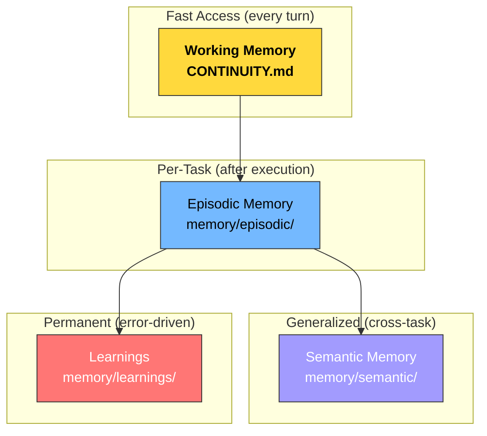
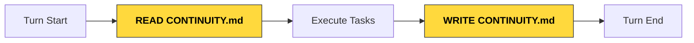
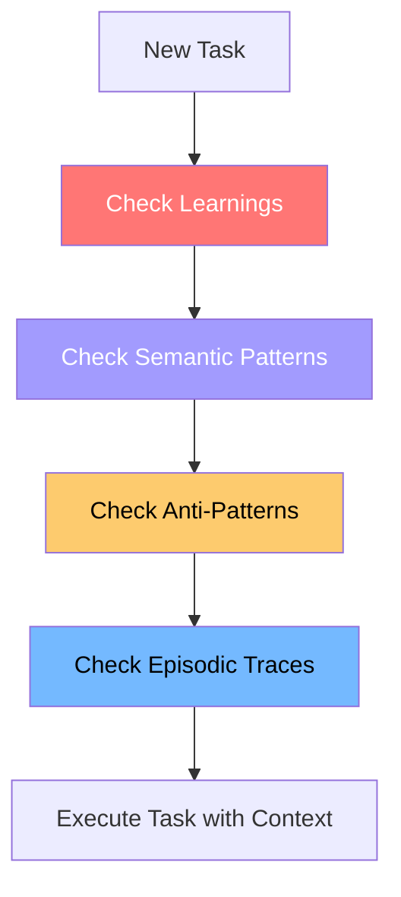
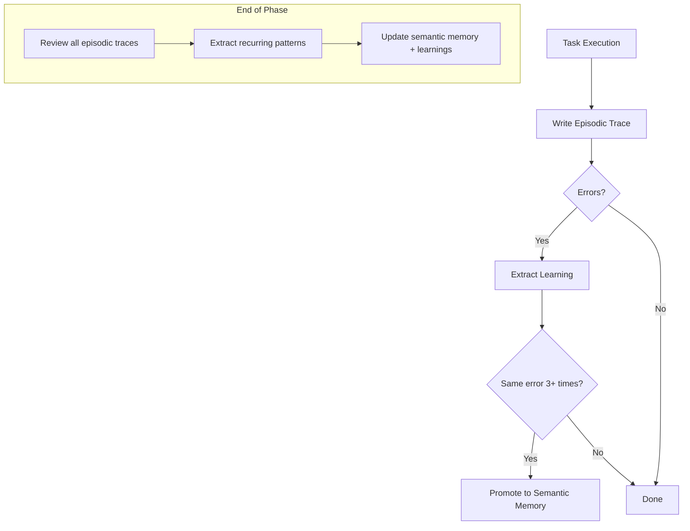

# Memory System

## Core Principle

> Memory is more valuable than reasoning. An agent that remembers its mistakes outperforms one with better reasoning but no memory.

The framework uses a **4-layer memory hierarchy** to give agents persistent, cross-session context.

## Memory Hierarchy



| Layer | Location | Purpose | Retention |
|-------|----------|---------|-----------|
| **Working Memory** | `.sdlc/CONTINUITY.md` | Current session state | Overwritten each turn |
| **Episodic Memory** | `.sdlc/memory/episodic/` | Per-task execution traces | Per project |
| **Semantic Memory** | `.sdlc/memory/semantic/` | Generalized patterns | Cross-project (portable) |
| **Learnings** | `.sdlc/memory/learnings/` | Mistakes and corrections | Permanent |

## Working Memory: CONTINUITY.md

The **most critical file** in the framework. Read at the start of every turn, written at the end.



### Template

```markdown
# CONTINUITY — Working Memory

## Current Phase
[Phase name and number]

## Active Tasks
- [Task ID]: [Description] — [Status]

## Completed Tasks
- [Task ID]: [Description] — [Timestamp]

## Mistakes & Learnings
- [Date]: [What went wrong] → [What we learned]

## Decisions Made
- [Date]: [Decision] — [Rationale]

## Next Steps
1. [Immediate next action]
2. [Following action]

## Open Questions
- [Question that needs resolution]

## Blocked Items
- [Item]: [Reason blocked] — [Unblock action]
```

### Protocol

**At the start of every turn:**
1. Read `.sdlc/CONTINUITY.md`
2. Read "Mistakes & Learnings" to avoid past errors
3. Check current phase and active tasks
4. Resume from where you left off

**At the end of every turn:**
1. Update "Current Phase" and "Active Tasks"
2. Add any new mistakes or learnings
3. Update "Next Steps" with what to do next
4. Write updated content back

## Episodic Memory

Per-task execution traces stored after each task completes.

**Location:** `.sdlc/memory/episodic/{date}/task-{id}.json`

```json
{
  "id": "ep-2026-01-15-001",
  "task_id": "task-042",
  "timestamp": "2026-01-15T10:30:00Z",
  "duration_seconds": 342,
  "agent": "sub-code-generator",
  "phase": "development",
  "context": {
    "goal": "Implement POST /api/todos endpoint",
    "constraints": ["No third-party deps", "< 200ms response"],
    "files_involved": ["src/routes/todos.ts", "src/db/todos.ts"]
  },
  "action_log": [
    {"t": 0, "action": "read_file", "target": "interface-contracts.yaml"},
    {"t": 5, "action": "write_file", "target": "src/routes/todos.ts"},
    {"t": 120, "action": "run_test", "result": "fail", "error": "missing return type"},
    {"t": 140, "action": "edit_file", "target": "src/routes/todos.ts"},
    {"t": 180, "action": "run_test", "result": "pass"}
  ],
  "outcome": "success",
  "errors_encountered": [
    {
      "type": "TypeScript compilation",
      "message": "Missing return type annotation",
      "resolution": "Added explicit :void to route handler"
    }
  ],
  "artifacts_produced": ["src/routes/todos.ts", "tests/todos.test.ts"],
  "git_commit": "abc123"
}
```

## Semantic Memory

Generalized patterns extracted from episodic memory. Two types:

### Patterns (what works)

**Location:** `.sdlc/memory/semantic/patterns.json`

```json
{
  "id": "sem-001",
  "pattern": "Express route handlers require explicit return types in strict mode",
  "category": "typescript",
  "conditions": ["Using TypeScript strict mode", "Writing Express route handlers"],
  "correct_approach": "Add :void to handler signature",
  "incorrect_approach": "Omitting return type annotation",
  "confidence": 0.95,
  "source_episodes": ["ep-2026-01-15-001"],
  "usage_count": 1
}
```

### Anti-Patterns (what to avoid)

**Location:** `.sdlc/memory/semantic/anti-patterns.json`

```json
{
  "id": "anti-001",
  "pattern": "Never use string concatenation for SQL queries",
  "category": "security",
  "why": "SQL injection vulnerability",
  "correct_alternative": "Use parameterized queries or ORM",
  "severity": "critical",
  "source_episodes": ["ep-2026-01-15-003"]
}
```

## Learnings

Extracted from task failures and corrections. The most actionable memory layer.

**Location:** `.sdlc/memory/learnings/{date}.json`

```json
{
  "id": "learn-001",
  "date": "2026-01-15",
  "agent": "sub-code-generator",
  "task_id": "task-042",
  "what_went_wrong": "Route handler missing return type caused build failure",
  "root_cause": "TypeScript strict mode enforces return type annotations",
  "fix_applied": "Added :void to async handler signature",
  "prevention_rule": "Always add return type annotations to Express handlers",
  "applicable_to": ["typescript", "express", "route-handlers"]
}
```

## Memory Retrieval Strategy

Before executing any task, agents check memory in priority order:



| Task Type | Memory Priority |
|-----------|----------------|
| Code generation | Learnings > Patterns > Episodic |
| Bug fixing | Learnings > Anti-patterns > Episodic |
| Architecture | Patterns > Anti-patterns > Learnings |
| Testing | Patterns > Learnings > Episodic |
| Security review | Anti-patterns > Learnings > Patterns |

## Memory Lifecycle



## How Layers Work Together

1. **CONTINUITY.md** = what you need right now (this session)
2. **Episodic memory** = what happened (task traces)
3. **Semantic memory** = what you know (general patterns)
4. **Learnings** = what you got wrong (mistake prevention)

The system creates a feedback loop: errors → learnings → patterns → prevention. Over time, the agent becomes more effective as its memory grows.
