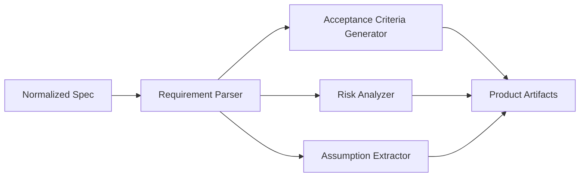
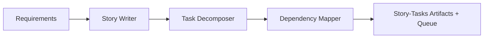
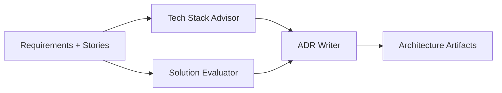
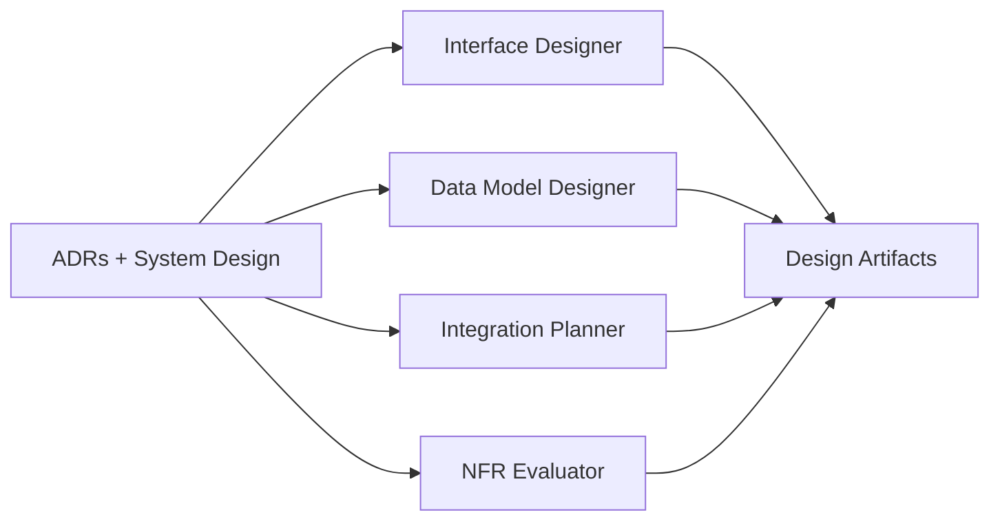
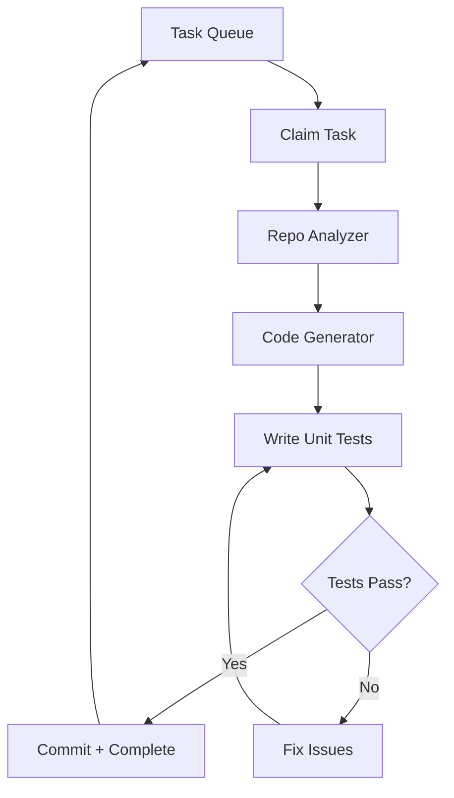
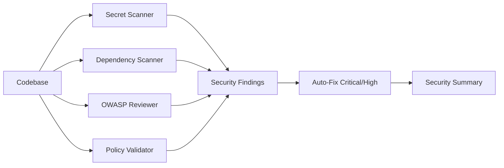
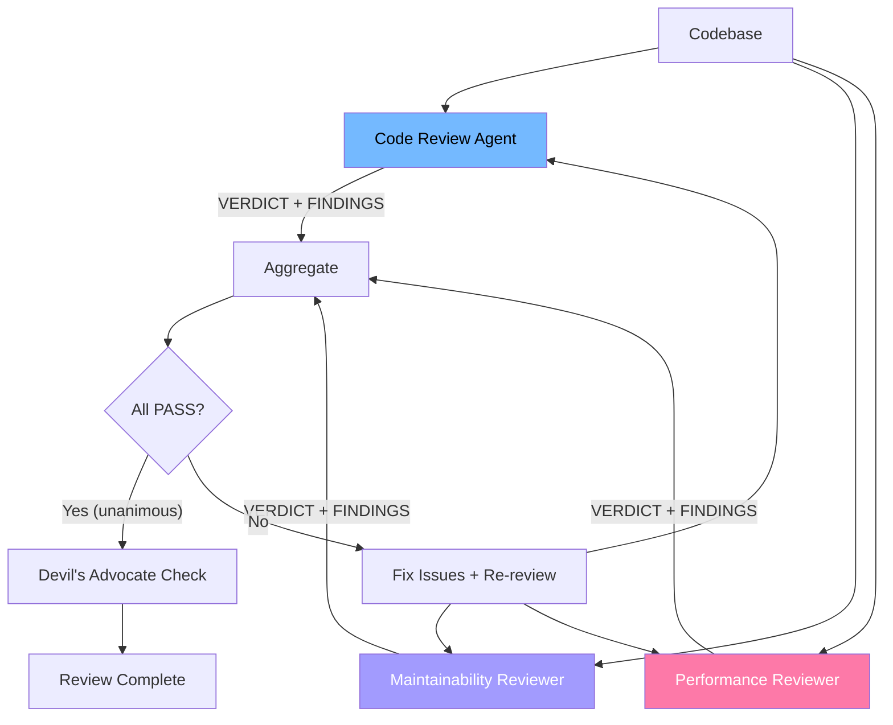

# SDLC Phases

## Phase Pipeline

The framework executes 13 sequential phases (0-12), each with a quality gate. Phase 12 (Retirement) is triggered, not run by default. After every phase (except Phase 1 and Phase 9), 3 blind reviewers assess that phase’s artifacts.

```mermaid
flowchart TD
    PN1["Phase 0: Problem Discovery<br/>Validate problem, go/no-go"] -->|"Gate 0: Problem Validated"| P0
    P0["Phase 1: Bootstrap<br/>Initialize, normalize spec"] -->|"Gate 1: Spec Valid"| P1
    P1["Phase 2: Product<br/>Requirements, risks, criteria"] -->|"Gate 2: Requirements Complete"| P2
    P2["Phase 3: Story-Tasks<br/>Epics, stories, tasks, deps"] -->|"Gate 3: Story-Task Traceable"| P3
    P3["Phase 4: Architecture<br/>System design, ADRs"] -->|"Gate 4: Architecture Sound"| P4
    P4["Phase 5: Design<br/>APIs, data model, NFRs"] -->|"Gate 5: Design Complete"| P5
    P5["Phase 6: Development<br/>Implement codebase"] -->|"Gate 6: Build Green"| P6
    P6["Phase 7: Testing<br/>Unit, integration, regression"] -->|"Gate 7: Coverage Met"| P7
    P7["Phase 8: Security<br/>Scan, audit, remediate"] -->|"Gate 8: Security Clear"| P8
    P8["Phase 9: Review<br/>Blind 3-reviewer system"] -->|"Gate 9: Review Passed"| P9
    P9["Phase 10: DevOps<br/>CI/CD, Docker, deploy"] -->|"Gate 10: Pipeline Green"| P10
    P10["Phase 11: Observability<br/>SLOs, alerts, monitoring"] -->|"Gate 11: Observability Ready"| DONE
    DONE -.->|"triggered"| P12["Phase 12: Retirement<br/>Deprecate, migrate, decommission"]
    P12 -->|"Gate 12: Retirement Complete"| RETIRED["RETIRED"]

    DONE["PROJECT COMPLETE"]

    style PN1 fill:#00b894,color:#fff
    style P0 fill:#6c5ce7,color:#fff
    style P1 fill:#a29bfe,color:#fff
    style P2 fill:#74b9ff,color:#fff
    style P3 fill:#81ecec,color:#000
    style P4 fill:#00cec9,color:#000
    style P5 fill:#55efc4,color:#000
    style P6 fill:#ffeaa7,color:#000
    style P7 fill:#fab1a0,color:#000
    style P8 fill:#ff7675,color:#fff
    style P9 fill:#fd79a8,color:#fff
    style P10 fill:#e17055,color:#fff
    style P12 fill:#636e72,color:#fff
    style DONE fill:#00b894,color:#fff,font-weight:bold
    style RETIRED fill:#2d3436,color:#fff,font-weight:bold
```



**Phase 0 (Problem Discovery)** and **Phase 12 (Retirement)** are detailed in [`docs/lifecycle/`](lifecycle/complete-lifecycle-overview.md); a NO-GO decision in Phase 0 stops the pipeline before Bootstrap runs.

**Configurability:** Don't need every stage? Any phase (except Phase 1 Bootstrap) and any individual subagent can be disabled via `sdlc phases` / `.sdlc/phase-config.json` — see [`cli-reference.md#sdlc-phases`](cli-reference.md#sdlc-phases). Disabled phases are marked `"skipped"` in `orchestrator.json` and the pipeline advances past them without running their gate or per-phase review.

## Phase 1: Bootstrap

**Purpose:** Initialize the framework and normalize the input spec.

**Agent:** Orchestrator (direct — no stage agent)

**Actions:**
1. Create `.sdlc/` directory structure
2. Parse and normalize input spec (PRD, YAML, brief, issue)
3. Store normalized spec in `.sdlc/specs/normalized-spec.md`
4. Detect project complexity (simple / medium / complex / enterprise)
5. Select agent team based on complexity
6. Initialize `CONTINUITY.md` and `orchestrator.json`

**Gate 1 — Spec Valid:** Input spec is parseable, non-empty, contains actionable requirements.

## Phase 2: Product Discovery

**Purpose:** Analyze requirements, identify risks, generate acceptance criteria.

**Agent:** `stage-product` with 4 subagents



**Artifacts:**
| File | Content |
|------|---------|
| `artifacts/product/requirements.md` | Structured requirements (functional + NFR) |
| `artifacts/product/acceptance-criteria.md` | Given/When/Then criteria per feature |
| `artifacts/product/risks.md` | Risk register with severity and mitigations |
| `artifacts/product/assumptions.md` | Hidden assumptions flagged for validation |

**Gate 2 — Requirements Complete:** All requirements have IDs, acceptance criteria, and risk assessment.

## Phase 3: Story-Tasks

**Purpose:** Decompose requirements into implementable epics, stories, and tasks.

**Agent:** `stage-story-tasks` with 3 subagents



**Artifacts:**
| File | Content |
|------|---------|
| `artifacts/story-tasks/epics.md` | Epic definitions |
| `artifacts/story-tasks/stories.md` | User stories with criteria |
| `artifacts/story-tasks/tasks.json` | Task list with dependencies |
| `artifacts/story-tasks/dependency-graph.md` | Dependency graph |
| `queue/pending.json` | Populated task queue |

**Gate 3 — Story-Task Traceable:** Every story traces to a requirement. No circular dependencies.

## Phase 4: Architecture

**Purpose:** Define high-level system architecture, select tech stack, document decisions as ADRs.

**Agent:** `stage-architecture` with 3 subagents



**Artifacts:**
| File | Content |
|------|---------|
| `artifacts/architecture/system-design.md` | High-level architecture |
| `artifacts/architecture/tech-stack.md` | Technology stack with justification |
| `artifacts/architecture/solution-evaluation.md` | Trade-off analysis |
| `artifacts/architecture/adrs/` | Architecture Decision Records |

**Gate 4 — Architecture Sound:** System design documented, tech stack justified, ADRs for all major decisions.

## Phase 5: Design

**Purpose:** Create detailed technical design: interface contracts, data/state models, integrations, NFRs. All design decisions reference ADRs.

**Agent:** `stage-design` with 4 subagents



**Artifacts:**
| File | Content |
|------|---------|
| `artifacts/design/detailed-design.md` | Detailed technical design |
| `artifacts/design/interface-contracts.*` | Interface contracts (format varies by project type) |
| `artifacts/design/data-model.md` | Data/state model |
| `artifacts/design/integrations.md` | External system integration plan |
| `artifacts/design/nfr-assessment.md` | NFR evaluation with target metrics |

**Gate 5 — Design Complete:** Interface contracts valid for the project type, data/state model defined, NFRs have targets, designs reference ADRs. `sub-compliance-validator` runs here if `.sdlc/governance/compliance-policy.yaml` has enabled frameworks.

## Phase 6: Development

**Purpose:** Implement the codebase task by task.

**Agent:** `stage-development` with 4 subagents



**Per-task workflow:**
1. Claim from `queue/pending.json` → move to `queue/active.json`
2. Read task definition + architecture docs
3. Implement following existing patterns (repo analyzer)
4. Write unit tests alongside implementation
5. Run tests until passing
6. Commit checkpoint
7. Move to `queue/completed.json`

**Gate 6 — Build Green:** Zero build errors, zero lint errors, all unit tests pass.

## Phase 7: Testing

**Purpose:** Comprehensive testing beyond unit tests.

**Agent:** `stage-testing` with 4 subagents

**Testing layers:**
1. **Unit Tests** — ≥80% coverage (sub-unit-test)
2. **Integration Tests** — Component interactions (sub-integration-test)
3. **Regression Tests** — From acceptance criteria (sub-regression-test)
4. **Test Data** — Fixtures, mocks, factories (sub-test-data)

**Gate 7 — Coverage Met:** Unit ≥80%, all acceptance criteria have tests, integration tests pass.

## Phase 8: Security

**Purpose:** Security audit — scan, review, remediate.

**Agent:** `stage-security` with 4 subagents



**Gate 8 — Security Clear:** Zero Critical/High findings, no hardcoded secrets, dependencies patched. `sub-compliance-validator` runs here if compliance frameworks are enabled.

## Phase 9: Review

**Purpose:** Multi-perspective code review with anti-sycophancy.

**Agent:** `stage-review` with 3 subagents (blind parallel)



**Key rules:**
- All 3 reviewers run **blind** — no visibility of each other's findings
- Unanimous PASS triggers an **anti-sycophancy check** (Devil's Advocate)
- Severity: Critical/High/Medium block; Low → TODO; Cosmetic → info only

**Gate 9 — Review Passed:** All reviewers PASS, no Critical/High/Medium findings.

## Phase 10: DevOps

**Purpose:** CI/CD pipeline, containerization, deployment.

**Agent:** `stage-devops` (no subagents)

**Outputs:** CI/CD config (GitHub Actions / GitLab CI), Dockerfile, docker-compose, deployment runbook, environment configs.

**Gate 10 — Pipeline Green:** CI runs without errors, Docker builds, runbook complete.

## Phase 11: Observability

**Purpose:** Monitoring, alerting, operational readiness.

**Agent:** `stage-observability` (no subagents)

**Outputs:** SLO/SLI definitions, logging config, alert rules, dashboard specs, operational runbook, health check endpoints.

**Gate 11 — Observability Ready:** SLOs defined, health checks implemented, alerts configured.

## Phase 12: Retirement (Triggered)

**Purpose:** Safely deprecate and decommission a system — migration, compliant data retention, infrastructure removal.

**Agent:** `stage-retirement` with 4 subagents

**Triggers:** Explicit deprecation request, replacement system deployed, end-of-support reached.

**Gate 12 — Retirement Complete:** ≥90 days notice, migration documented, compliant data retention, infra decommissioned, post-mortem complete. See [Phase 12: Retirement](lifecycle/phase-12-retirement.md).

## Per-Phase Review

After every phase (except Phase 1 and Phase 9), the orchestrator dispatches the full Review agent (3 blind reviewers) to assess that phase’s artifacts:

```
Phase N completes → Quality Gate N → PASS → Per-Phase Review (3 blind reviewers) → PASS → Phase N+1
```

Phase 9 (Review) is the final full-codebase review and does NOT get a secondary per-phase review.
