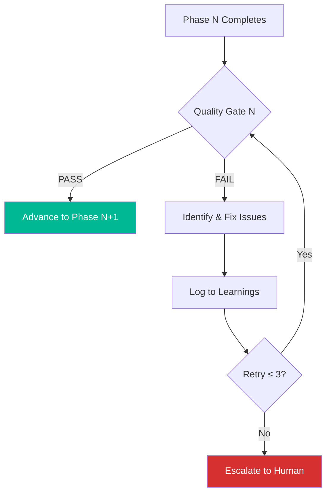
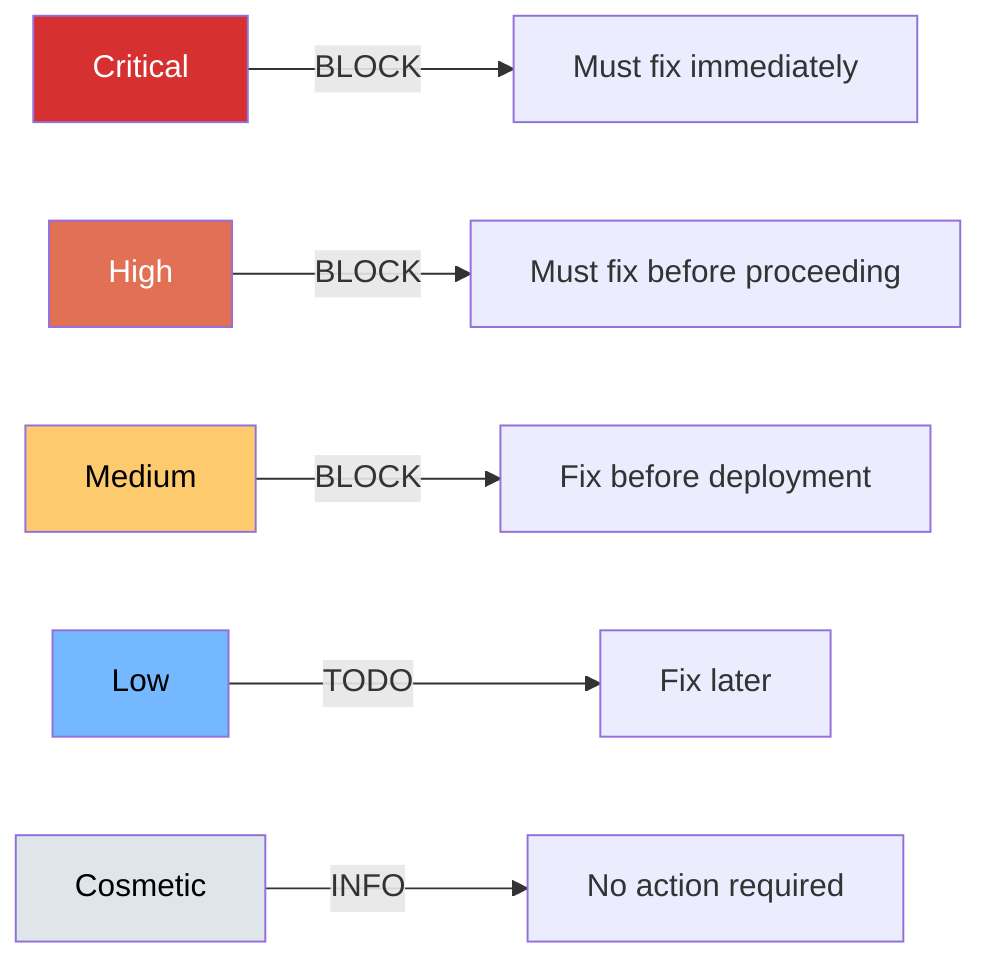
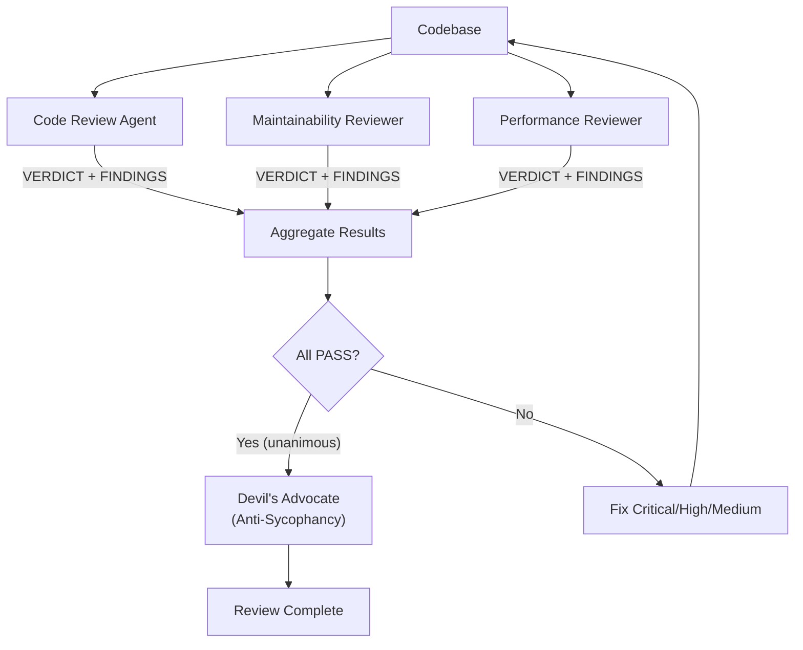
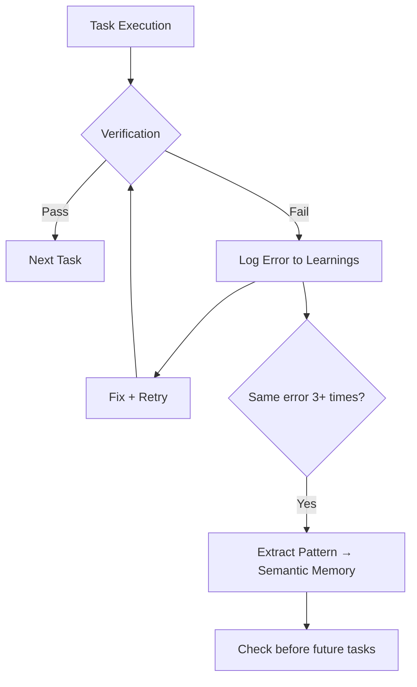

# Quality Gates

## Overview

Every phase transition requires passing a quality gate. Gates are binary: **PASS** or **FAIL**. A FAIL blocks the transition until resolved (max 3 retries, then escalate to human).



## The 13 Gates

| # | Gate | Phase | Pass Criteria |
|---|------|-------|---------------|
| 0 | **Problem Validated** | 0 (Problem Discovery) | Problem clear/measurable, ≥3 pain points, positive business case, ≥3 alternatives, go/no-go recorded |
| 1 | **Input Validation** | 1 (Bootstrap) | Spec is parseable, non-empty, has actionable requirements |
| 2 | **Requirements Completeness** | 2 (Product) | All requirements structured with acceptance criteria, risks identified |
| 3 | **Story-Task Traceability** | 3 (Story-Tasks) | Stories trace to requirements, tasks have done criteria, no circular deps |
| 4 | **Architecture Soundness** | 4 (Architecture) | System design documented, tech stack justified, ADRs for all decisions |
| 5 | **Design Completeness** | 5 (Design) | Interface contracts valid for project type, data/state model defined, NFRs have targets, designs reference ADRs, compliance sign-off if enabled |
| 6 | **Build Green** | 6 (Development) | Zero build errors, zero lint errors, all unit tests pass |
| 7 | **Test Coverage** | 7 (Testing) | Unit ≥ 80%, all acceptance criteria have tests, integration tests pass |
| 8 | **Security Clear** | 8 (Security) | Zero Critical/High findings, no hardcoded secrets, deps patched, compliance sign-off if enabled |
| 9 | **Review Passed** | 9 (Review) | All 3 reviewers PASS, no Critical/High/Medium findings |
| 10 | **Pipeline Green** | 10 (DevOps) | CI/CD runs without errors, Docker builds, runbook complete |
| 11 | **Observability Ready** | 11 (Observability) | SLOs defined, health checks implemented, alerts configured |
| 12 | **Retirement Complete** | 12 (Retirement, triggered) | ≥90 days notice, migration documented, compliant data retention, infra decommissioned, post-mortem complete |

**Per-Phase Review:** After every phase (except Phase 1 and Phase 9), the orchestrator dispatches 3 blind reviewers on that phase’s artifacts. Both the quality gate AND per-phase review must PASS before advancing.

**Governance Gate (opt-in):** If `.sdlc/governance/` is present, every gate additionally checks risk-policy.yaml approvals, budget-policy.yaml limits, and token-policy.yaml limits — see [AI Governance Overview](governance/ai-governance-overview.md).

## Gate Details

### Gate 0: Problem Validated
```
CHECK: Problem statement is clear and measurable
CHECK: >=3 user pain points documented with evidence
CHECK: Business case shows positive ROI or explicit strategic value
CHECK: >=3 solution alternatives evaluated (including "don't build")
CHECK: Go/No-Go decision documented with rationale
OUTPUT: .sdlc/artifacts/problem-discovery/ contains all deliverables
```

### Gate 1: Input Validation
```
CHECK: Spec file exists and is non-empty
CHECK: At least one actionable requirement identified
CHECK: No contradictory requirements
OUTPUT: .sdlc/specs/ contains normalized spec
```

### Gate 2: Requirements Completeness
```
CHECK: Every requirement has a unique ID
CHECK: Every requirement has acceptance criteria (Given/When/Then)
CHECK: Risk register exists with severity ratings
CHECK: Assumptions are documented
OUTPUT: .sdlc/artifacts/product/ contains all deliverables
```

### Gate 3: Story-Task Traceability
```
CHECK: Every user story references a requirement ID
CHECK: Every task has clear done criteria
CHECK: Dependency graph has no cycles
CHECK: All tasks estimated (S/M/L or hours)
OUTPUT: .sdlc/queue/pending.json populated
```

### Gate 4: Architecture Soundness
```
CHECK: System design has component diagram and communication patterns
CHECK: Tech stack selected with justification for each layer
CHECK: ADRs exist for technology stack, API style, and database choice
CHECK: Solution evaluation covers ≥ 2 alternatives per decision
OUTPUT: .sdlc/artifacts/architecture/ contains all deliverables
```

### Gate 5: Design Completeness
```
CHECK: Interface contracts exist and are valid for the project type
CHECK: Data/state model defines storage structures and access patterns
CHECK: Every NFR has a measurable target
CHECK: Every design decision references an ADR
OUTPUT: .sdlc/artifacts/design/ contains all deliverables
```

### Gate 6: Build Green
```
CHECK: Build completes without errors
CHECK: Linter reports zero errors
CHECK: Type checker reports zero errors (if typed language)
CHECK: All unit tests pass
OUTPUT: Clean build + passing test suite
```

### Gate 7: Test Coverage
```
CHECK: Unit test coverage ≥ 80%
CHECK: Every acceptance criterion has at least one test
CHECK: Integration tests pass
CHECK: Test data fixtures exist
OUTPUT: .sdlc/artifacts/testing/ contains reports
```

### Gate 8: Security Clear
```
CHECK: Secret scanner finds zero secrets in code
CHECK: Dependency scanner finds zero Critical/High CVEs
CHECK: OWASP review finds zero Critical/High issues
CHECK: Security policies enforced (CORS, CSP, rate limiting)
OUTPUT: .sdlc/artifacts/security/ contains reports
```

### Gate 9: Review Passed
```
CHECK: All 3 reviewers return PASS verdict
CHECK: No Critical/High/Medium findings remain
CHECK: Anti-sycophancy check passed (if unanimous PASS)
OUTPUT: .sdlc/artifacts/review/ contains reports
```

### Gate 10: Pipeline Green
```
CHECK: CI pipeline configuration is valid
CHECK: Docker build succeeds (if applicable)
CHECK: Deployment runbook is complete
CHECK: Environment configs exist for all targets
OUTPUT: .sdlc/artifacts/devops/ contains configs
```

### Gate 11: Observability Ready
```
CHECK: SLOs defined for critical user journeys
CHECK: Health check endpoint implemented
CHECK: Alert rules defined for error scenarios
CHECK: Logging configuration is structured (JSON)
OUTPUT: .sdlc/artifacts/observability/ contains specs
```

### Gate 12: Retirement Complete
```
CHECK: Deprecation timeline published (>=90 days notice, or emergency approval on record)
CHECK: Migration path documented for all affected user/stakeholder segments
CHECK: Data retention/deletion plan complies with active compliance frameworks
CHECK: All infrastructure decommissioned or archived
CHECK: Post-mortem completed with learnings
CHECK: CRITICAL decommission actions have 2 recorded human sign-offs
OUTPUT: .sdlc/artifacts/retirement/ contains all deliverables
```

## Severity Model

Findings from quality gates are classified by severity:



| Severity | Definition | Action |
|----------|-----------|--------|
| **Critical** | Security vulnerability, data loss, crash | BLOCK — fix immediately |
| **High** | Broken functionality, major bug | BLOCK — fix before proceeding |
| **Medium** | Minor bug, code smell, perf issue | BLOCK — fix before deployment |
| **Low** | Style issue, minor improvement | TODO comment |
| **Cosmetic** | Formatting, naming suggestion | Informational |

## Blind Review System

Used in Phase 9 (Review) and per-phase reviews. Three reviewers operate independently:



**Rules:**
- Reviewers cannot see each other's findings (blind)
- Unanimous PASS triggers a 4th "Devil's Advocate" review
- The Devil's Advocate specifically looks for issues others missed
- This prevents AI reviewers from rubber-stamping

## Velocity-Quality Feedback Loop



**Metrics to track:**

| Metric | Target | Red Flag |
|--------|--------|----------|
| First-attempt success rate | ≥ 70% | < 50% |
| Average retries per task | ≤ 1.5 | > 3 |
| Regression rate | ≤ 5% | > 15% |
| Quality gate first-pass rate | ≥ 80% | < 60% |
