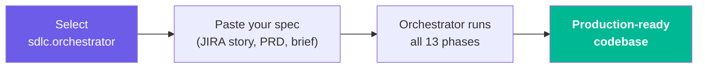
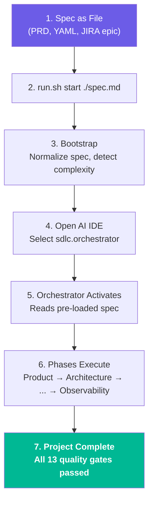
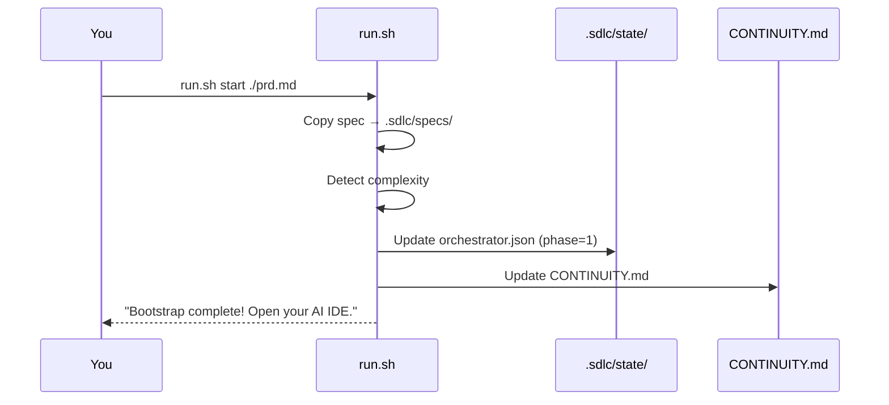
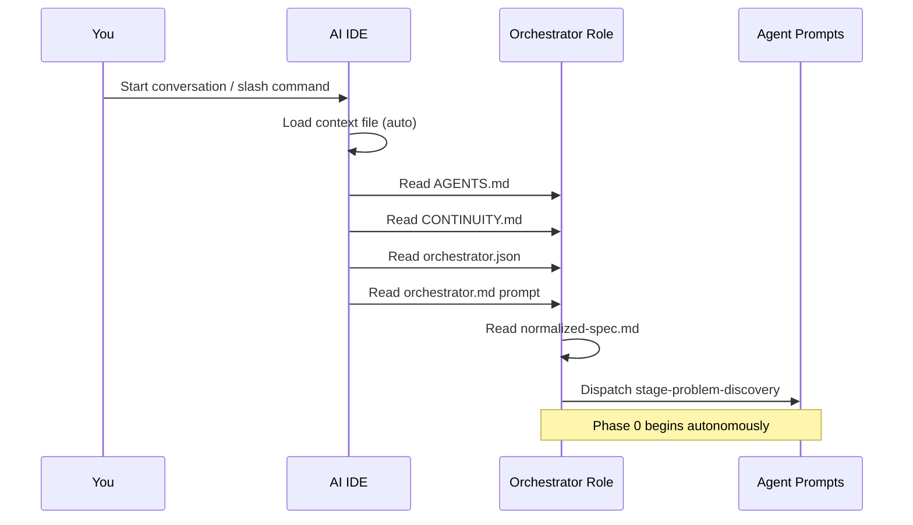
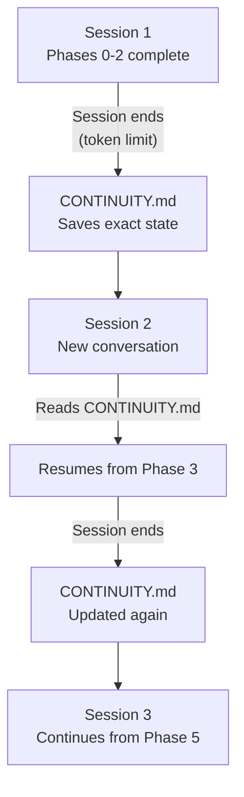

# Usage Guide

This guide covers everything that happens **after** you run `sdlc init .` — from feeding your first spec to getting a production-ready codebase.

## Quick Start: Agent Dropdown (Easiest)

The simplest way to use the framework — no terminal commands needed after setup.



### How It Works

1. **Select the agent** — Pick `sdlc.orchestrator` from your IDE's agent/command dropdown
2. **Paste your spec** — JIRA story, PRD, requirements, or even a one-liner
3. **The orchestrator takes over** — It validates the problem (Phase 0), bootstraps `.sdlc/`, normalizes your spec, detects complexity, and drives all 13 phases autonomously

### Per-IDE Instructions

| IDE | How to Select |
|-----|---------------|
| **Copilot** | Click the agent dropdown → select `sdlc.orchestrator` |
| **Devin Desktop** | Type `/sdlc.orchestrator` in Devin Local chat |
| **Claude Code** | Type `/sdlc-orchestrator` in chat |
| **Cursor** | Context auto-loads; just say "start the SDLC orchestrator" |
| **opencode** | Use `/sdlc-orchestrator` command |
| **Gemini CLI** | Use `/sdlc-orchestrator` command |

### Example: JIRA Story

Select the agent, then paste:

```
PROJ-101 User Registration

As a new user, I want to register with email and password so I can access the platform.

Acceptance Criteria:
- Given a valid email and password (8+ chars, 1 uppercase, 1 number),
  when I POST /api/v1/auth/register, then a 201 response with user ID is returned
- Given a duplicate email, when I POST /api/v1/auth/register,
  then a 409 Conflict is returned
- Given an invalid email format, when I POST /api/v1/auth/register,
  then a 422 with validation errors is returned

Tech Stack: Python 3.12, FastAPI, PostgreSQL, pytest
```

The orchestrator reads your message, saves it to `.sdlc/specs/normalized-spec.md`, and begins Phase 0: Problem Discovery. No `run.sh` needed.

### Example: Quick Prototype

```
Build a REST API for a task management app with JWT auth, CRUD for projects and tasks,
PostgreSQL database, and Docker deployment. Use Node.js with TypeScript and Express.
```

### When to Use This Approach

- **Single JIRA story** — paste the story description + acceptance criteria
- **Quick prototypes** — paste a one-liner or short brief
- **Small specs** — anything that fits comfortably in a chat message

---

## Alternative: CLI Start (For Larger Specs)

For multi-story JIRA epics or large PRD documents, pre-load the spec as a file:



## Supported Spec Formats

The framework accepts any text-based spec. Here are the supported formats:

### Markdown PRD (recommended)

A structured Product Requirements Document. Best for greenfield projects.

```bash
.sdlc/framework/run.sh start ./prd.md
```

See [`examples/sample-prd.md`](../examples/sample-prd.md) for a full example.

### YAML Spec

Structured requirements with IDs. Best when you already have well-defined requirements.

```bash
.sdlc/framework/run.sh start ./spec.yaml
```

See [`examples/sample-spec.yaml`](../examples/sample-spec.yaml) for a full example.

### JIRA Epic / Story

Copy your JIRA epic description and stories into a markdown file. Best for teams already using JIRA.

```bash
.sdlc/framework/run.sh start ./jira-epic.md
```

See [JIRA Workflow](jira-workflow.md) for the full guide and [`examples/sample-jira-epic.md`](../examples/sample-jira-epic.md) for an example.

### One-Liner Brief

A single sentence describing what to build. Best for quick prototypes.

```bash
.sdlc/framework/run.sh start "Build a REST API for task management with auth and PostgreSQL"
```

### JSON Spec

```bash
.sdlc/framework/run.sh start ./spec.json
```

## CLI Start Details

```bash
.sdlc/framework/run.sh start ./your-spec.md
```

This command:
1. Copies your spec to `.sdlc/specs/normalized-spec.md`
2. Detects complexity (simple / medium / complex / enterprise) based on spec size
3. Updates `.sdlc/state/orchestrator.json` — marks bootstrap complete
4. Updates `.sdlc/CONTINUITY.md` — sets phase to "Product Discovery"
5. Prints the next step: open your AI IDE



### Complexity Detection

| Spec Size | Detected Complexity | Agent Team |
|-----------|-------------------|------------|
| ≤ 15 lines | Simple | Minimal subagents |
| 16–50 lines | Medium | Core subagents per stage |
| 51–100 lines | Complex | All subagents |
| 100+ lines | Enterprise | All subagents + extended review |

## Open Your AI IDE

Open your IDE and start a new conversation. The orchestrator activates automatically through the context file installed during `sdlc init`.

### Per-IDE Launch

| IDE | How to Start |
|-----|-------------|
| **Devin Desktop** | Open Devin Local chat → type `/sdlc.orchestrator` |
| **GitHub Copilot** | Open Copilot Chat → use `/sdlc.orchestrator` agent |
| **Claude Code** | Start conversation → use `/sdlc-orchestrator` slash command |
| **Cursor** | Open chat → the rules auto-load, type "start the SDLC orchestrator" |
| **opencode** | Start session → use `/sdlc-orchestrator` command |
| **Gemini CLI** | Start session → use `/sdlc-orchestrator` command |
| **Codex CLI** | Start session → context auto-loads |
| **Amp** | Start session → use `/sdlc-orchestrator` command |
| **Kilo Code** | Start session → context auto-loads |

### What Happens in the IDE

When you start the conversation, the AI:

1. **Reads `AGENTS.md`** — discovers the 52 available agents
2. **Reads `.sdlc/CONTINUITY.md`** — picks up current state (Phase 0: Problem Discovery)
3. **Reads `.sdlc/state/orchestrator.json`** — confirms phase progress
4. **Reads `.sdlc/framework/agents/orchestrator.md`** — adopts the orchestrator role
5. **Reads `.sdlc/specs/normalized-spec.md`** — ingests your spec
6. **Begins Phase 0** — dispatches the Problem Discovery agent



## Watch the Phases Execute

The orchestrator drives all 13 phases autonomously. Here's what happens in each:

### Phase 0: Problem Discovery

Before any build work, the AI validates the problem is worth solving and produces a go/no-go decision:

| Artifact | Path | What It Contains |
|----------|------|-----------------|
| Problem Statement | `.sdlc/artifacts/problem-discovery/problem-statement.md` | Clear, testable problem definition |
| Business Case | `.sdlc/artifacts/problem-discovery/business-case.md` | Value/opportunity assessment |
| Go/No-Go Decision | `.sdlc/artifacts/problem-discovery/decision.md` | Build vs. buy vs. don't-build recommendation |

### Phase 1: Bootstrap

The orchestrator normalizes the spec, detects complexity, selects the agent team, and initializes governance. (Orchestrator-direct — no dedicated stage agent.)

### Phase 2: Product

The AI reads your spec and produces:

| Artifact | Path | What It Contains |
|----------|------|-----------------|
| Requirements | `.sdlc/artifacts/product/requirements.md` | Structured functional + non-functional requirements |
| Acceptance Criteria | `.sdlc/artifacts/product/acceptance-criteria.md` | Given/When/Then for each requirement |
| Risk Register | `.sdlc/artifacts/product/risks.md` | Identified risks with severity + mitigations |
| Assumptions | `.sdlc/artifacts/product/assumptions.md` | Hidden assumptions surfaced for validation |

### Phase 3: Story-Tasks

| Artifact | Path | What It Contains |
|----------|------|------------------|
| Epics | `.sdlc/artifacts/story-tasks/epics.md` | Epic definitions |
| Stories | `.sdlc/artifacts/story-tasks/stories.md` | User stories with acceptance criteria |
| Dependency Graph | `.sdlc/artifacts/story-tasks/dependency-graph.md` | Task dependency map |
| Task Queue | `.sdlc/queue/pending.json` | Prioritized task list with dependencies |

### Phase 4: Architecture

| Artifact | Path | What It Contains |
|----------|------|------------------|
| System Design | `.sdlc/artifacts/architecture/system-design.md` | High-level architecture |
| Tech Stack | `.sdlc/artifacts/architecture/tech-stack.md` | Technology selection + justification |
| ADRs | `.sdlc/artifacts/architecture/adrs/` | Architecture Decision Records |

### Phase 5: Design

| Artifact | Path | What It Contains |
|----------|------|------------------|
| Interface Contracts | `.sdlc/artifacts/design/interface-contracts.*` | Interface contracts (format varies by project type) |
| Data Model | `.sdlc/artifacts/design/data-model.md` | Data/state model |
| NFR Assessment | `.sdlc/artifacts/design/nfr-assessment.md` | Non-functional requirements evaluation |
| Integrations | `.sdlc/artifacts/design/integrations.md` | External system integration plan |

### Phase 6: Development

The AI implements code task-by-task:
- Claims tasks from the queue
- Writes implementation + unit tests
- Commits after each passing task
- Moves completed tasks to `queue/completed.json`

### Phase 7–11: Testing → Security → Review → DevOps → Observability

Each phase produces artifacts in its respective `.sdlc/artifacts/<phase>/` directory.

### Phase 12: Retirement (triggered only)

Run only when a deprecation/decommission is explicitly triggered — produces the deprecation plan, migration guide, data-retention policy, and decommission checklist.

### Full Artifact Tree

```
.sdlc/
├── artifacts/
│   ├── product/
│   │   ├── requirements.md
│   │   ├── acceptance-criteria.md
│   │   ├── risks.md
│   │   └── assumptions.md
│   ├── architecture/
│   │   ├── system-design.md
│   │   ├── tech-stack.md
│   │   ├── solution-evaluation.md
│   │   └── adrs/
│   ├── story-tasks/
│   │   ├── epics.md
│   │   ├── stories.md
│   │   ├── tasks.json
│   │   └── dependency-graph.md
│   ├── design/
│   │   ├── detailed-design.md
│   │   ├── interface-contracts.*
│   │   ├── data-model.md
│   │   ├── integrations.md
│   │   └── nfr-assessment.md
│   ├── development/
│   │   └── (implementation logs)
│   ├── testing/
│   │   └── (test reports, coverage)
│   ├── security/
│   │   └── (scan reports, findings)
│   ├── review/
│   │   └── (review reports, verdicts)
│   ├── devops/
│   │   └── (CI/CD configs, Dockerfile)
│   └── observability/
│       └── (SLOs, alert rules, dashboards)
├── specs/
│   ├── original-spec.*
│   └── normalized-spec.md
├── state/
│   └── orchestrator.json
├── queue/
│   ├── pending.json
│   ├── active.json
│   └── completed.json
├── memory/
│   ├── episodic/
│   ├── semantic/
│   └── learnings/
└── CONTINUITY.md
```

## Monitor Progress

### Check Status

```bash
# Rich console dashboard (requires Python install)
sdlc status

# Shell alternative (no Python needed)
.sdlc/framework/run.sh status
```

Both show: current phase, task counts, phase completion, agent assignments, queue sizes, activity log, and CONTINUITY.md summary.

### Agent Dashboard (STATUS.md)

The orchestrator maintains `.sdlc/STATUS.md` — a markdown file with tabular status of every phase, agent, and subagent:

```bash
cat .sdlc/STATUS.md
```

Includes four tables:
- **Overall Progress** — Status, complexity, current phase, tasks done, gates passed
- **Phase & Agent Status** — Each phase with its responsible agent, subagents used, status, gate result, and key outcome
- **Subagent Detail** — All subagents with individual status and outcome
- **Artifacts Produced** — Every file generated, by phase

### Activity Log

Every agent action is recorded in `.sdlc/state/activity-log.md`:

```bash
cat .sdlc/state/activity-log.md
```

Each entry includes: timestamp, agent ID, subagents dispatched, action summary, artifacts produced, and gate result.

### Read CONTINUITY.md

The most direct way to see what's happening:

```bash
cat .sdlc/CONTINUITY.md
```

This file is updated at the end of every AI turn and shows:
- Current phase and active tasks
- Completed tasks with timestamps
- Mistakes and learnings
- Decisions made
- Next steps
- Open questions and blocked items

### Check Orchestrator State (JSON)

```bash
cat .sdlc/state/orchestrator.json | python3 -m json.tool
```

Machine-readable phase-by-phase status and gate results.

### Check Queue

```bash
# How many tasks pending/active/completed
cat .sdlc/queue/pending.json | python3 -c "import json,sys; print(len(json.load(sys.stdin)),'pending')"
cat .sdlc/queue/completed.json | python3 -c "import json,sys; print(len(json.load(sys.stdin)),'completed')"
```

## Multi-Session Workflow

AI IDE sessions have token limits. The framework handles this through CONTINUITY.md:



### What to Do When a Session Ends

1. The AI updates `CONTINUITY.md` before the session ends
2. Start a **new conversation** in your IDE
3. The orchestrator reads `CONTINUITY.md` and resumes exactly where it left off
4. No manual intervention needed — just start a new chat

### If a Session Ends Unexpectedly

If the session crashes or times out without updating CONTINUITY.md:
1. Check `.sdlc/state/orchestrator.json` for the last completed phase
2. Check `.sdlc/queue/` to see task progress
3. Start a new conversation — the orchestrator will detect the inconsistency and recover

## Resetting and Re-Running

### Full Reset

Deletes all runtime state, keeps framework files:

```bash
.sdlc/framework/run.sh reset
```

Then start fresh:

```bash
.sdlc/framework/run.sh start ./your-spec.md
```

### Starting Over with a Different Spec

```bash
.sdlc/framework/run.sh reset
.sdlc/framework/run.sh start ./new-spec.md
```

## Tips for Best Results

### Write Good Specs

The better your input spec, the better the output. Include:
- **Functional requirements** — What the system should do
- **Non-functional requirements** — Performance, security, scalability targets
- **Technology preferences** — Language, framework, database
- **Out of scope** — What NOT to build (reduces hallucination)
- **Constraints** — Budget, timeline, compliance requirements

### Use Acceptance Criteria

If your spec includes Given/When/Then acceptance criteria, the framework uses them directly in the testing phase. This dramatically improves test coverage quality.

### Specify Tech Stack

If you don't specify a tech stack, the AI picks one based on requirements. Be explicit if you have preferences:

```markdown
## Technology
- Python 3.12 with FastAPI
- PostgreSQL 16
- Redis for caching
- Docker for deployment
```

### Review Phase Artifacts

After each phase, review the artifacts in `.sdlc/artifacts/<phase>/`. The orchestrator continues autonomously, but you can intervene by editing artifacts before the next phase starts.

### Keep Sessions Short

If your AI IDE has aggressive token limits, consider running one phase per session. The framework handles this naturally through CONTINUITY.md.

## Troubleshooting

### "The orchestrator didn't start"

- Check that your IDE context file exists (e.g., `.devin/rules/sdlc.md`)
- Verify `AGENTS.md` is at the project root
- Try explicitly pasting the orchestrator prompt: copy contents of `.sdlc/framework/agents/orchestrator.md` into the chat

### "The spec wasn't picked up"

- Verify `.sdlc/specs/normalized-spec.md` exists and has content
- Run `.sdlc/framework/run.sh status` to confirm bootstrap completed
- Check that `orchestrator.json` shows `current_phase: 1`

### "The AI stopped mid-phase"

- Normal — IDE sessions have token limits
- Start a new conversation; CONTINUITY.md handles the resume
- If it keeps stopping at the same point, the task may be too large — try splitting your spec into smaller pieces

### "Quality gate keeps failing"

- Check `.sdlc/CONTINUITY.md` for the "Mistakes & Learnings" section
- The orchestrator retries up to 3 times
- After 3 failures, it escalates — you may need to simplify requirements or add constraints

## Next Steps

- [JIRA Workflow](jira-workflow.md) — Using JIRA stories/epics as input
- [SDLC Phases](phases.md) — Detailed phase-by-phase reference
- [Quality Gates](quality-gates.md) — Understanding gate criteria
- [Memory System](memory-system.md) — How the AI remembers across sessions
